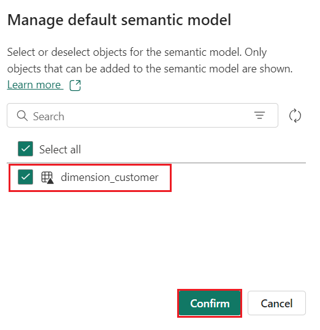
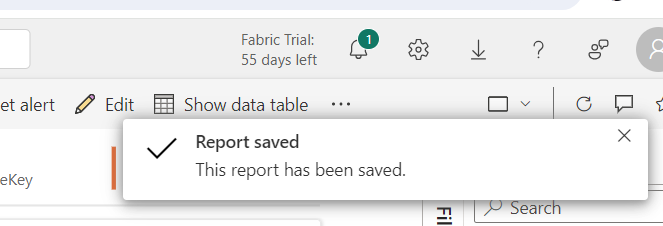
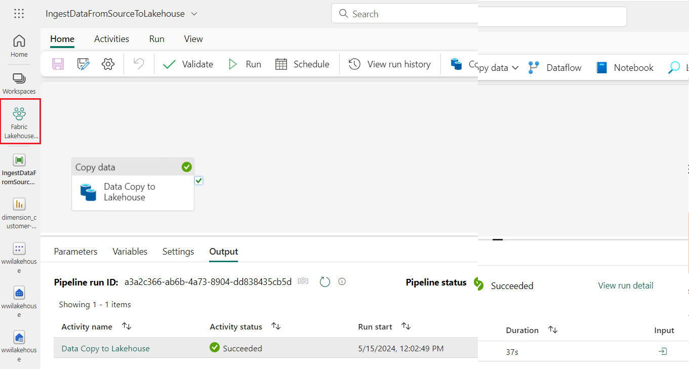
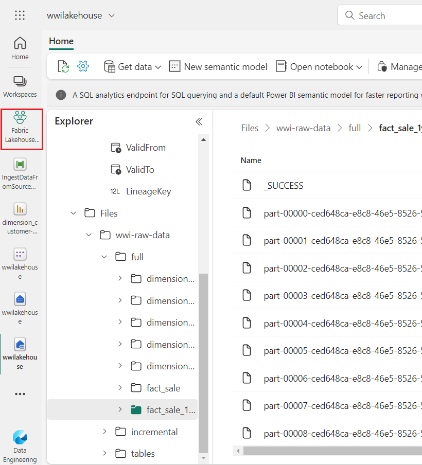
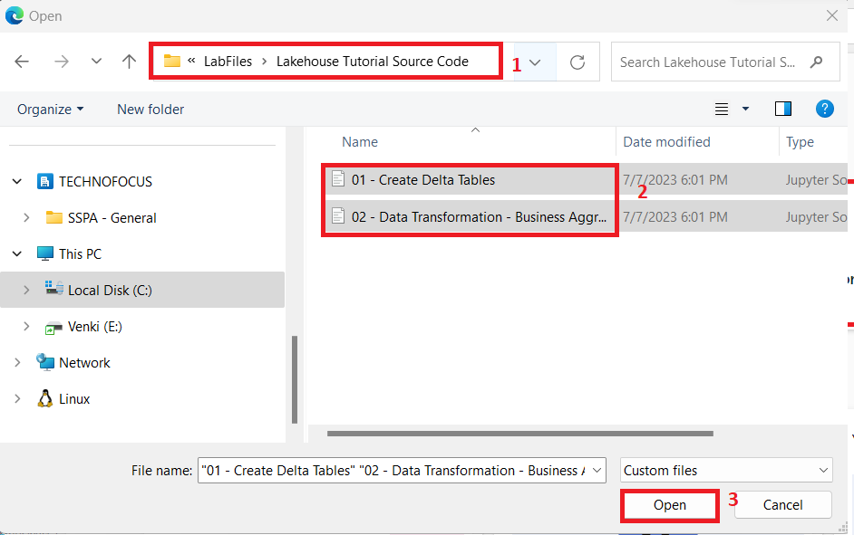
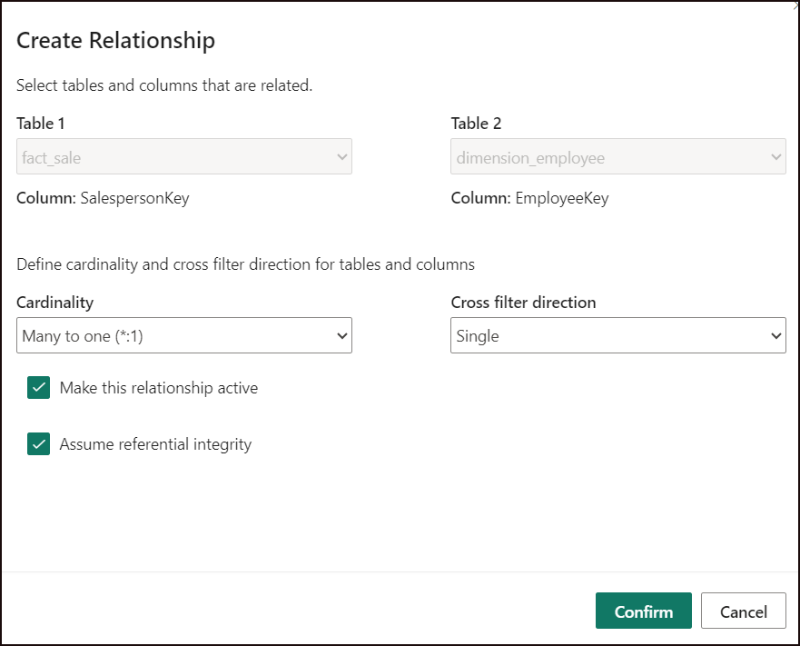
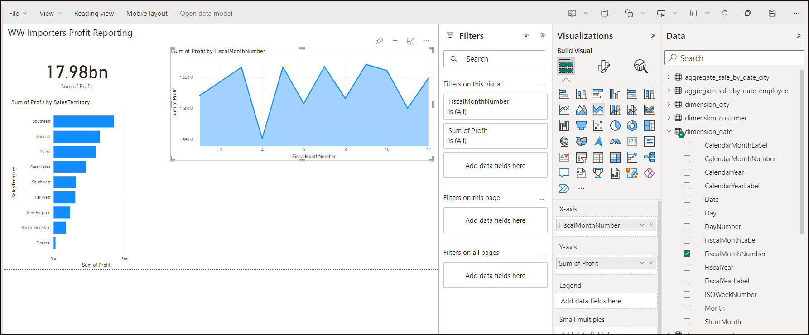
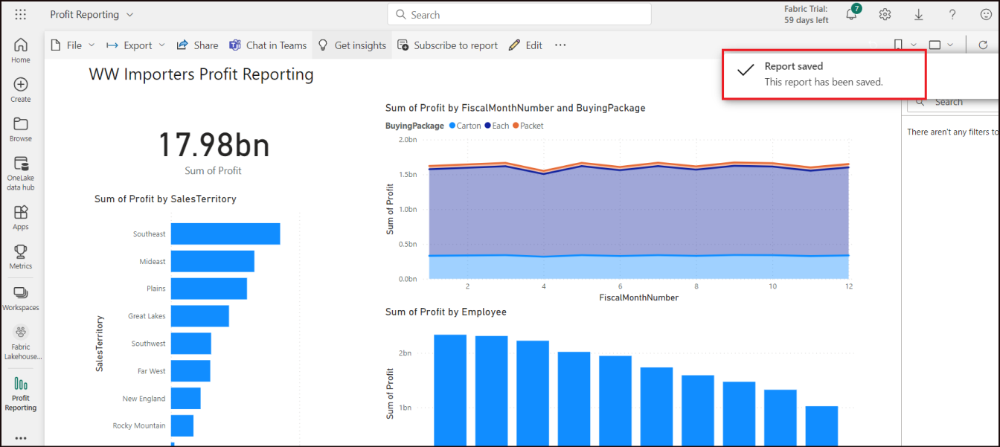

**Introduction**

This lab walks you through an end-to-end scenario from data acquisition
to data consumption. It helps you build a basic understanding of Fabric,
including the different experiences and how they integrate, as well as
the professional and citizen developer experiences that come with
working on this platform. This lab isn't intended to be a reference
architecture, an exhaustive list of features and functionality, or a
recommendation of specific best practices.

Traditionally, organizations have been building modern data warehouses
for their transactional and structured data analytics needs. And data
lakehouses for big data (semi/unstructured) data analytics needs. These
two systems ran in parallel, creating silos, data duplicity, and
increased total cost of ownership.

Fabric with its unification of data store and standardization on Delta
Lake format allows you to eliminate silos, remove data duplicity, and
drastically reduce total cost of ownership.

With the flexibility offered by Fabric, you can implement either
lakehouse or data warehouse architectures or combine them together to
get the best of both with simple implementation. In this tutorial,
you're going to take an example of a retail organization and build its
lakehouse from start to finish. It uses the [medallion
architecture](https://learn.microsoft.com/en-us/azure/databricks/lakehouse/medallion) where
the bronze layer has the raw data, the silver layer has the validated
and deduplicated data, and the gold layer has highly refined data. You
can take the same approach to implement a lakehouse for any organization
from any industry.

This lab explains how a developer at the fictional Wide World Importers
company from the retail domain completes the following steps.

**Objectives**:

1\. Sign in to Power BI account and initiate a free Microsoft Fabric
trial.

2\. Start the Microsoft Fabric (Preview) trial within Power BI.

3\. Configure OneDrive sign-up for the Microsoft 365 admin center.

4\. Build and implement an end-to-end lakehouse for the organization,
including creating a Fabric workspace and a lakehouse.

5\. Ingest sample data into the lakehouse and prepare it for further
processing.

6\. Transform and prepare the data using Python/PySpark and SQL
notebooks.

7\. Create business aggregate tables using different approaches.

8\. Establish relationships between tables for seamless reporting.

9\. Build a Power BI report with visualizations based on the prepared
data.

10\. Save and store the created report for future reference and
analysis.

# Exercise 1: Setup Lakehouse end-to-end scenario 

# Task 1: Sign in to Power BI account and sign up for the free [Microsoft Fabric trial](https://learn.microsoft.com/en-us/fabric/get-started/fabric-trial)

1.  Open your browser, navigate to the address bar, and type or paste
    the following URL:
    [https://app.fabric.microsoft.com/](https://app.fabric.microsoft.com/,)
    then press the **Enter** button.

> 

2.  In the **Microsoft Fabric** window, enter your **Microsoft 365**
    credentials, and click on the **Submit** button.

>  style="width:6.49167in;height:3.11667in" />

3.  Then, In the **Microsoft** window enter the password and click on
    the **Sign in** button**.**

>  style="width:4.50833in;height:3.83333in" />

4.  In **Stay signed in?** window, click on the **Yes** button.

>  style="width:4.58333in;height:3.66667in" />

5.  You’ll be directed to Power BI Home page.


# Task 2: Start the Microsoft Fabric (Preview) trial

Follow these steps to start your Fabric trial.

1.  On **Power BI Home** page, click on the **Account manager** on the
    right side. In the Account manager blade, navigate and
    select **Start trial** as shown in the below image**.**


2.  If prompted, agree to the terms and then select **Start trial**.

> 

3.  Once your trial capacity is ready, you receive a confirmation
    message. Select **Fabric Home Page** to begin working in Fabric.

>  style="width:5.54167in;height:2.01667in" />

4.  Open your Account manager again. Notice that you now have a heading
    for **Trial status**. Your Account manager keeps track of the number
    of days remaining in your trial. You will also see the countdown in
    your Fabric menu bar when you work in a product experience.

> 

# Task 3: OneDrive configured sign up for the Microsoft 365 admin center

1.  Open your browser, navigate to the address bar, and type or paste
    the following URL:
    <https://admin.microsoft.com/AdminPortal/Home#/homepage> then press
    the **Enter** button.

>  alt="A screenshot of a computer Description automatically generated" />

**Note**: If you are directly landed on **Microsoft 365 admin center**
page, then skip steps from \#2 to \#4.

2.  In the **Microsoft Azure** window, enter your **Sign-in**
    credentials, and click on the **Next** button.

>  alt="A screenshot of a computer Description automatically generated" />

3.  Then, in the **Microsoft** window, enter the password and click on
    the **Sign in** button**.**

>  style="width:4.50833in;height:3.83333in" />

4.  In **Stay signed in?** window, click on the **Yes** button.

>  style="width:4.58333in;height:3.66667in" />

5.  On the left-side of Microsoft 365 admin center page, click on the
    **App launcher** as shown in the below image.

>  alt="A screenshot of a computer Description automatically generated" />

6.  Under the **Apps** section, navigate and click on the **OneDrive.**

>  alt="A screenshot of a computer Description automatically generated" />

7.  In **OneDrive** page, under **Securely store and share files,**
    select **Your OneDrive is ready**


# Exercise 2: Build and implement an end-to-end lakehouse for your organization

## **Task 1: Create a Fabric workspace**

In this task, you create a Fabric workspace. The workspace contains all
the items needed for this lakehouse tutorial, which includes lakehouse,
dataflows, Data Factory pipelines, the notebooks, Power BI datasets, and
reports.

1.  Go back to **Power BI** window. On the left side navigation menu of
    Power BI Home page, navigate and click on **Workspaces**.


2.  In the Workspaces pane, click on **+** **New workspace** button**.**

>  style="width:4.20833in;height:8.10833in" />

3.  In the **Create a workspace** pane that appears on the right side,
    enter the following details, and click on the **Apply** button.

| **Name** | **Fabric Lakehouse Tutorial-*XX ****(*XX can be a unique number) (here, we entered **Fabric Lakehouse Tutorial-29**) |
|----|----|
| **Description** | This workspace contains all the items for the lakehouse tutorial |
| **Advanced** | Under **License mode**, select **Trial** |
| **Default storage format** | **Small dataset storage format** |
| **Template apps** | **Check the Develop template apps** |

>  style="width:4.97917in;height:6.0311in" />


4.  Wait for the deployment to complete. It takes 2-3 minutes to
    complete.


## **Task 2: Create a lakehouse**

1.  In the **Power BI Fabric Lakehouse Tutorial-XX** page, click on the
    **Power BI** icon located at the bottom left and select **Data
    Engineering** under Synapse.

>  style="width:5.4125in;height:6.23131in" />

2.  In the **Synapse** **Data Engineering** **Home** page,
    select **Lakehouse** to create a lakehouse.


3.  In the **New lakehouse** dialog box, enter **wwilakehouse** in
    the **Name** field, click on the **Create** button and open the new
    lakehouse.

> **Note**: Ensure to remove space before **wwilakehouse**.
>
> 
>
>  style="width:6.74863in;height:4.46087in" />

4.  You will see a notification stating **Successfully created SQL
    endpoint**.

>  style="width:3.39196in;height:2.88358in" />

## **Task 3: Ingest sample data**

1.  In the **wwilakehouse** page, navigate to **Get data in your
    lakehouse** section, and click on **New Dataflow Gen2** as shown in
    the below image.

>  style="width:6.49167in;height:3.13333in" />

2.  On the Dataflow canvas, navigate and click on **Import from a
    Text/CSV file**.

>  style="width:6.49167in;height:3.05833in" />

3.  On the **Connect to data source** pane, select the **Upload
    file** radio button. Click on the **Browse button** and browse to
    **C:\LabFiles** on your VM, then select
    **dimension_customer.csv** file and click on **Open** button.

> 
>
> 

4.  Then, click on the **Next** button.

> 

5.  In the **Preview file data** page, go through the data and click on
    the **Create** button. You’ll be directed to **Dataflow** canvas.

>  style="width:6.78417in;height:2.99583in" />

6.  In the **Query settings** pane on the right side of the Dataflow
    canvas, ensure that **dimension_customer** is selected under the
    **Name** field. Similarly, ensure that **Lakehouse** is selected
    under the **Data destination** field.

>  style="width:6.27342in;height:5.7375in" />
>
> ***Note:***

- *If needed, from the **Connect to data destination** screen, sign into
  your account. Select **Next**.*

- Navigate to the **wwilakehouse** in your workspace.

- If the **dimension_customer** table doesn't exist, select the **New
  table** setting and enter the table name **dimension_customer**. If
  the table already exists, select the **Existing table** setting and
  choose **dimension_customer** from the list of tables in the object
  explorer, then select **Next**.

** *Note: ****Fabric adds a space and number at the end of the table
name by default. Table names must be lower case and must not contain
spaces. Please rename it appropriately and remove any spaces from the
table name.*

7.  From the Dataflow canvas, you can easily transform the data based on
    your business requirements. For simplicity, we aren't making any
    changes in this task. To proceed, select **Publish** at the bottom
    right of the screen.

> 

8.  A spinning circle next to the dataflow's name indicates publishing
    is in progress in the item view. 

9.  In the **Fabric Lakehouse Tutorial-XX** tab, when publishing is
    completed, move your mouse to **Dataflow 1** row and click on the
    horizontal ellipses (**…**), then navigate and click on
    **Properties** as shown in the below image.

>  style="width:6.49167in;height:4.33333in" />

10. In the Dataflow 1 pane that appear on the right side, rename the
    dataflow to  **Load Lakehouse Table**  and select **Save**.

>  style="width:6.05833in;height:7.19167in" />

11. Select the **Refresh now** option next to data flow name to refresh
    the dataflow. It runs the dataflow and moves data from the source
    file to lakehouse table. While it's in progress, you see a spinning
    circle under **Refreshed** column in the item view.


>  style="width:3.29583in;height:1.52917in" />

12. Refreshing data will take around 4-5 min.


13. Once the dataflow is refreshed, select **wwilakehouse** in the left
    navigation panel to view the **dimension_customer** delta table.
    Select the table to preview its data.


14. You can also use the SQL endpoint of the lakehouse to query the data
    with SQL statements. Select **SQL analytics endpoint** from
    the **Lakehouse** drop-down menu at the top right of the screen.


15. In the wwilakehouse page, under Explorer select
    the **dimension_customer** table to preview its data and
    select **New SQL query** to write your SQL statements.


16. The following sample query aggregates the row count based on the
    **BuyingGroup column** of the **dimension_customer** table. SQL
    query files are saved automatically for future reference, and you
    can rename or delete these files based on your need. Paste the code
    as shown in the below image, then click on the play icon to **Run**
    the script.

> SQLCopy
>
> <span class="mark">SELECT BuyingGroup, Count(\*) AS Total</span>
>
> <span class="mark">FROM dimension_customer</span>
>
> <span class="mark">GROUP BY BuyingGroup</span>


**Note**: If you encounter an error during the execution of the script,
then crosscheck the script syntax with the above image.


17. Previously all the lakehouse tables and views were automatically
    added to the semantic model. With the recent updates, for new
    lakehouses, you have to manually add your tables to the semantic
    model.

18. From the lakehouse **Reporting** tab, select **Manage default Power
    BI semantic model** and select the tables that you want to add to
    the semantic model.

>  style="width:7.04368in;height:2.42917in" />

19. In **Manage default semantic model** tab, select
    the **dimension_customer** table and click on **Confirm.**

>  alt="A screenshot of a computer Description automatically generated" />

## **Task 4: Build a report**

1.  Now, click on **Fabric Lakehouse** **Tutorial-XX** on the left-sided
    navigation pane.


2.  In the **Fabric Lakehouse Tutorial-XX** view, select
    **wwilakehouse** of Type **Semantic model(default)**. This dataset
    is automatically created and has the same name as the lakehouse.

>  alt="A screenshot of a computer Description automatically generated" />

3.  From the semantic model pane, you can view all the tables. You have
    options to create reports either from scratch, paginated report, or
    let Power BI automatically create a report based on your data. For
    this tutorial, under **Explore this data**, select **Auto-create a
    report** as shown in the below image.


4.  Since the table is a dimension and there are no measures in it,
    Power BI creates a measure for the row count and aggregates it
    across different columns, and creates different charts as shown in
    the following image.

5.  Save this report for the future by selecting **Save** from the top
    ribbon.

>  style="width:7.08716in;height:3.52083in" />

6.  In the **Save your replort** dialog box, enter a name for your
    report as !! **dimension_customer-report** !!and select **Save.**


7.  You will see a notification stating **Report saved**.

>  alt="A screenshot of a computer Description automatically generated" />

# Exercise 3: Ingest data into the lakehouse

In this exercise, you ingest additional dimensional and fact tables from
the Wide World Importers (WWI) into the lakehouse.

## ** Task 1: Ingest data**

In this task, you use the **Copy data activity** of the Data Factory
pipeline to ingest sample data from an Azure storage account to
the **Files** section of the lakehouse you created earlier.

1.  Select **Workspaces** in the left navigation pane, and then select
    your new workspace (i.e., Fabric Lakehouse Tutorial-XX) from
    the **Workspaces** menu. The items view of your workspace appears.

> 
>
> 

2.  In the **Fabric Lakehouse Tutorial-XX** workspace page, navigate and
    click on **+New** button, then select **Data pipeline**.

>  style="width:7.00417in;height:5.05557in" />

3.  In the New pipeline dialog box, specify the name as
    **IngestDataFromSourceToLakehouse** and select **Create.** A new
    data factory pipeline is created and opened

> 
>
>  style="width:7.01885in;height:3.41494in" />

4.  On newly created data factory pipeline i.e
    **IngestDataFromSourceToLakehouse**, select  **pipeline
    activity** to add an activity to the pipeline and select **Copy
    data**. This action adds copy data activity to the pipeline canvas.

>  style="width:6.51274in;height:3.8625in" />

5.  Select the newly added copy data activity from the canvas. Activity
    properties appear in a pane below the canvas (you may need to expand
    the pane upwards by dragging the top edge). Under
    the **General** tab in the properties pane, specify the name for the
    copy data activity **Data Copy to Lakehouse**.

> 

6.  Under **Source** tab of the selected copy data activity,
    select **External** as **Data store type** and then select **+
    New** to create a new connection to data source.

>  style="width:6.8375in;height:5.66285in" />

7.  For this task, all the sample data is available in a public
    container of Azure blob storage. You connect to this container to
    copy data from it. On the **New connection** wizard, select **Azure
    Blob Storage** and then select **Continue**.


8.  On the next screen of the **New connection** wizard, enter the
    following details and select **Create** to create the connection to
    the data source.

| **Property** | **Value** |
|----|----|
| Account name or URI | https://azuresynapsestorage.blob.core.windows.net/sampledata |
| Connection | Create new connection |
| Connection name | Wwisampledata |
| Authentication kind | Anonymous |


9.  Once the new connection is created, return to the **Source** tab of
    the copy data activity, and the newly created connection is selected
    by default. Specify the following properties before moving to the
    destination settings.

<table>
<colgroup>
<col style="width: 18%" />
<col style="width: 81%" />
</colgroup>
<thead>
<tr class="header">
<th><strong>Property</strong></th>
<th><strong>Value</strong></th>
</tr>
</thead>
<tbody>
<tr class="odd">
<td>Data store type</td>
<td>External</td>
</tr>
<tr class="even">
<td>Connection</td>
<td>wwisampledata</td>
</tr>
<tr class="odd">
<td>File path type</td>
<td>File path</td>
</tr>
<tr class="even">
<td>File path</td>
<td>Container name (first text box): sampledata<br />
Directory name (second text box): WideWorldImportersDW/parquet</td>
</tr>
<tr class="odd">
<td>Recursively</td>
<td>Checked</td>
</tr>
<tr class="even">
<td>File Format</td>
<td>Binary</td>
</tr>
</tbody>
</table>


10. Under the **Destination** tab of the selected copy data activity,
    specify the following properties:

| **Property**              | **Value**                                     |
|---------------------------|-----------------------------------------------|
| Data store type           | Workspace                                     |
| Workspace data store type | Lakehouse                                     |
| Lakehouse                 | wwilakehouse                                  |
| Root Folder               | Files                                         |
| File path                 | Directory name (first text box): wwi-raw-data |
| File Format               | Binary                                        |


11. You have finished configuring the copy data activity. Select
    the **Save** button on the top ribbon (under **Home**) to save your
    changes.


12. You will see a notification stating **Saving completed.**


13. In the I**ngestDataFromSourceToLakehouse** page, navigate to command
    bar and click on **Run** to execute your pipeline and its activity.

> 

14. This action triggers data copy from the underlying data source to
    the specified lakehouse and might take up to a minute to complete.
    You can monitor the execution of the pipeline and its activity under
    the **Output** tab, which appears when you click anywhere on the
    canvas.


15. Under the Output tab, hover your mouse to **Data Copy to Lakehouse**
    row, select **Data Copy to Lakehouse** to look at the details of the
    data transfer. After seeing the **Status** as **Succeeded**, click
    on the **Close** button.


16. Now, click on **Fabric Lakehouse** **Tutorial-XX** on the left-side
    navigation pane and carefully select your new lakehouse
    (**wwilakehouse**) to launch the **Lakehouse explorer** as shown in
    the below image**.**

>  style="width:6.5625in;height:3.51683in" />
>
>  style="width:6.92783in;height:3.84583in" />

17. Validate that in the **Lakehouse explorer** view, a new
    folder **wwi-raw-data** has been created and data for all the tables
    have been copied there.


# Exercise 4: Prepare and transform data in the lakehouse

## **Task 1: Prepare data**

From the previous exercise steps, we have raw data ingested from the
source to the **Files** section of the lakehouse. Now you can transform
that data and prepare it for creating delta tables.

1.  Now, click on **Fabric Lakehouse** **Tutorial-XX** on the left-sided
    navigation pane.

> 

2.  In the **Synapse Data Engineering** page, navigate to **New**
    section and click on **Import notebook**.

> 

3.  Select **Upload** from the **Import status** pane that opens on the
    right side of the screen.

> **Note**: Ensure to select **All files (\*.\*)** from the dropdown
> beside **File name** field.
>
>  style="width:3.41667in;height:3.58333in" />

4.  Navigate and select **01-Create Delta Tables, 02-Data
    Transformation-Business Aggregation** notebook from **C:\LabFiles**
    and click on the **Open** button.

> 

5.  You will see a notification stating **Imported successfully.**

>  style="width:4.16615in;height:2.3747in" />

6.  After the import is successful, to see the newly imported notebooks,
    select **Fabric Lakehouse Tutorial-XX** under the **Recommended**
    section.

>  style="width:6.49167in;height:4.23333in" />
>
> 

7.  In **Fabric Lakehouse Tutorial-XX** pane,
    select **wwilakehouse** lakehouse to open it.


## Task 2: Transform data and load to silver Delta table

1.  In the **wwilakehouse** page, navigate and click on **Open
    notebook** drop in the command bar, then select **Existing
    notebook**.

>  style="width:6.94999in;height:3.85417in" />

2.  From the list of **Open existing notebook**, select the **01 -
    Create Delta Tables** notebook and select **Open**.


3.  In the open notebook in **Lakehouse explorer**, you see the notebook
    is already linked to your opened lakehouse.


** <span class="mark">Note</span>**

<span class="mark">Fabric provides
the [**V-order**](https://learn.microsoft.com/en-us/fabric/data-engineering/delta-optimization-and-v-order) capability
to write optimized delta lake files. V-order often improves compression
by three to four times and up to 10 times performance acceleration over
the Delta Lake files that aren't optimized. Spark in Fabric dynamically
optimizes partitions while generating files with a default 128 MB size.
The target file size may be changed per workload requirements using
configurations. With the [**optimize
write**](https://learn.microsoft.com/en-us/fabric/data-engineering/delta-optimization-and-v-order#what-is-optimized-write) capability,
the Apache Spark engine that reduces the number of files written and
aims to increase individual file size of the written data.</span>

4.  Before you write data as delta lake tables in the **Tables** section
    of the lakehouse, you use two Fabric features
    (**V-order** and **Optimize Write**) for optimized data writing and
    for improved reading performance. To enable these features in your
    session, set these configurations in the first cell of your
    notebook.

5.  To start the notebook and execute the cell, select the **Run** icon
    that appears to the left of the cell upon hover.


When running a cell, you didn't have to specify the underlying Spark
pool or cluster details because Fabric provides them through Live Pool.
Every Fabric workspace comes with a default Spark pool, called Live
Pool. This means when you create notebooks, you don't have to worry
about specifying any Spark configurations or cluster details. When you
execute the first notebook command, the live pool is up and running in a
few seconds. And the Spark session is established and it starts
executing the code. Subsequent code execution is almost instantaneous in
this notebook while the Spark session is active.


6.  Next, you read raw data from the **Files** section of the lakehouse
    and add more columns for different date parts as part of the
    transformation. You use partitionBy Spark API to partition the data
    before writing it as delta table based on the newly created data
    part columns (Year and Quarter).

7.  To execute the second cell, select **Run** icon that appears to the
    left of the cell upon hover.

> **Note**: In case, you are unable to see the output, then click on the
> horizontal lines on the left side of **Spark jobs**.
>
> ```Copy
> from pyspark.sql.functions import col, year, month, quarter
>
> table_name = 'fact_sale'
>
> df =
> spark.read.format("parquet").load('Files/wwi-raw-data/full/fact_sale_1y_full')
>
> df = df.withColumn('Year', year(col("InvoiceDateKey")))
>
> df = df.withColumn('Quarter', quarter(col("InvoiceDateKey")))
>
> df = df.withColumn('Month', month(col("InvoiceDateKey")))
>
> df.write.mode("overwrite").format("delta").partitionBy("Year","Quarter").save("Tables/" +
> table_name)


8.  After the fact tables load, you can move on to loading data for the
    rest of the dimensions. The following cell creates a function to
    read raw data from the **Files** section of the lakehouse for each
    of the table names passed as a parameter. Next, it creates a list of
    dimension tables. Finally, it loops through the list of tables and
    creates a delta table for each table name that's read from the input
    parameter.

9.  Select the cell and select  **Run** icon that appears to the left of
    the cell upon hover.

>```Copy
> from pyspark.sql.types import 
>
> def loadFullDataFromSource(table_name):
>
> df =
> spark.read.format("parquet").load('Files/wwi-raw-data/full/' +
> table_name)
>
> df.write.mode("overwrite").format("delta").save("Tables/" +
> table_name)
>
> full_tables = [
>
> 'dimension_city',
>
> 'dimension_date',
>
> 'dimension_employee',
>
> 'dimension_stock_item'
>
> ]
>
> for table in full_tables:
>
> loadFullDataFromSource(table)


10. To validate the created tables, click and select refresh on
    the **Tables**. The tables appear.

>  style="width:6.49167in;height:3.86667in" />
>
>  alt="A screenshot of a computer Description automatically generated" />

11. Go the items view of the workspace again, select **Fabric Lakehouse
    Tutorial-XX** and select the **wwilakehouse** lakehouse to open it.

> 
>
>  style="width:7.04047in;height:4.07083in" />

12. Now, open the second notebook. In the lakehouse view, dropdown the
    **Open notebook** and select **Existing notebook** from the top
    navigation menu.

>  style="width:7.00417in;height:4.47189in" />

13. From the list of Open existing notebook, select the **02 - Data
    Transformation - Business** **Aggregation** notebook and click on
    the **Open**.

>  style="width:7.00159in;height:4.24583in" />

14. In the open notebook in **Lakehouse explorer**, you see the notebook
    is already linked to your opened lakehouse.

15. To start the notebook and select the 1<sup>st</sup> cell and select
    the **Run** icon that appears to the left of the cell upon hover.


16. An organization might have data engineers working with Scala/Python
    and other data engineers working with SQL (Spark SQL or T-SQL), all
    working on the same copy of the data. Fabric makes it possible for
    these different groups, with varied experience and preference, to
    work and collaborate. The two different approaches transform and
    generate business aggregates. You can pick the one suitable for you
    or mix and match these approaches based on your preference without
    compromising on the performance:

- **Approach \#1** - Use PySpark to join and aggregates data for
  generating business aggregates. This approach is preferable to someone
  with a programming (Python or PySpark) background.

- **Approach \#2** - Use Spark SQL to join and aggregates data for
  generating business aggregates. This approach is preferable to someone
  with SQL background, transitioning to Spark.

17. **Approach \#1 (sale_by_date_city)** - Use PySpark to join and
    aggregate data for generating business aggregates. With the
    following code, you create three different Spark dataframes, each
    referencing an existing delta table. Then you join these tables
    using the dataframes, do group by to generate aggregation, rename a
    few of the columns, and finally write it as a delta table in
    the **Tables** section of the lakehouse to persist with the data.

> In this cell, you create three different Spark dataframes, each
> referencing an existing delta table.

\`\`\`Copy

> df_fact_sale = spark.read.table("wwilakehouse.fact_sale")
>
> df_dimension_date = spark.read.table("wwilakehouse.dimension_date")
>
> df_dimension_city = spark.read.table("wwilakehouse.dimension_city")
>
>  style="width:7.10387in;height:2.5625in" />

18. In this cell, you join these tables using the dataframes created
    earlier, do group by to generate aggregation, rename a few of the
    columns, and finally write it as a delta table in
    the **Tables** section of the lakehouse.

> ```Copy
> sale_by_date_city = df_fact_sale.alias("sale") \\
>
> .join(df_dimension_date.alias("date"), df_fact_sale.InvoiceDateKey ==
> df_dimension_date.Date, "inner") \\
>
> .join(df_dimension_city.alias("city"), df_fact_sale.CityKey ==
> df_dimension_city.CityKey, "inner") \\
>
> .select("date.Date", "date.CalendarMonthLabel", "date.Day",
> "date.ShortMonth", "date.CalendarYear", "city.City",
> "city.StateProvince", "city.SalesTerritory", "sale.TotalExcludingTax",
> "sale.TaxAmount", "sale.TotalIncludingTax", "sale.Profit")\\
>
> .groupBy("date.Date", "date.CalendarMonthLabel", "date.Day",
> "date.ShortMonth", "date.CalendarYear", "city.City",
> "city.StateProvince", "city.SalesTerritory")\\
>
> .sum("sale.TotalExcludingTax", "sale.TaxAmount",
> "sale.TotalIncludingTax", "sale.Profit")\\
>
> .withColumnRenamed("sum(TotalExcludingTax)",
> "SumOfTotalExcludingTax")\\
>
> .withColumnRenamed("sum(TaxAmount)", "SumOfTaxAmount")\\
>
> .withColumnRenamed("sum(TotalIncludingTax)",
> "SumOfTotalIncludingTax")\\
>
> .withColumnRenamed("sum(Profit)", "SumOfProfit")\\
>
> .orderBy("date.Date", "city.StateProvince", "city.City")
>
> sale_by_date_city.write.mode("overwrite").format("delta").option("overwriteSchema",
> "true").save("Tables/aggregate_sale_by_date_city")
>
>  style="width:7.04013in;height:3.2625in" />

19. **Approach \#2 (sale_by_date_employee)** - Use Spark SQL to join and
    aggregate data for generating business aggregates. With the
    following code, you create a temporary Spark view by joining three
    tables, do group by to generate aggregation, and rename a few of the
    columns. Finally, you read from the temporary Spark view and finally
    write it as a delta table in the **Tables** section of the lakehouse
    to persist with the data.

> In this cell, you create a temporary Spark view by joining three
> tables, do group by to generate aggregation, and rename a few of the
> columns.
>
> ```Copy
> %%sql
>
> CREATE OR REPLACE TEMPORARY VIEW sale_by_date_employee
>
> AS
>
> SELECT
>
> DD.Date, DD.CalendarMonthLabel
>
> , DD.Day, DD.ShortMonth Month, CalendarYear Year
>
> ,DE.PreferredName, DE.Employee
>
> ,SUM(FS.TotalExcludingTax) SumOfTotalExcludingTax
>
> ,SUM(FS.TaxAmount) SumOfTaxAmount
>
> ,SUM(FS.TotalIncludingTax) SumOfTotalIncludingTax
>
> ,SUM(Profit) SumOfProfit
>
> FROM wwilakehouse.fact_sale FS
>
> INNER JOIN wwilakehouse.dimension_date DD ON FS.InvoiceDateKey =
> DD.Date
>
> INNER JOIN wwilakehouse.dimension_Employee DE ON FS.SalespersonKey =
> DE.EmployeeKey
>
> GROUP BY DD.Date, DD.CalendarMonthLabel, DD.Day, DD.ShortMonth,
> DD.CalendarYear, DE.PreferredName, DE.Employee
>
> ORDER BY DD.Date ASC, DE.PreferredName ASC, DE.Employee ASC


20. In this cell, you read from the temporary Spark view created in the
    previous cell and finally write it as a delta table in
    the **Tables** section of the lakehouse.

>```Copy
> sale_by_date_employee = spark.sql("SELECT \* FROM
> sale_by_date_employee")
>
> sale_by_date_employee.write.mode("overwrite").format("delta").option("overwriteSchema",
> "true").save("Tables/aggregate_sale_by_date_employee")


21. To validate the created tables, click and select refresh on
    the **Tables**. The aggregate tables appear.


Both the approaches produce a similar outcome. You can choose based on
your background and preference, to minimize the need for you to learn a
new technology or compromise on the performance.

Also you may notice that you're writing data as delta lake files. The
automatic table discovery and registration feature of Fabric picks up
and registers them in the metastore. You don't need to explicitly
call CREATE TABLE statements to create tables to use with SQL.

# Exercise 5: Building reports in Microsoft Fabric

In this section of the tutorial, you create a Power BI data model and
create a report from scratch.

** **

## **Task 1: Explore data in the silver layer using the SQL endpoint**

Power BI is natively integrated in the whole Fabric experience. This
native integration brings a unique mode, called DirectLake, of accessing
the data from the lakehouse to provide the most performant query and
reporting experience. DirectLake mode is a groundbreaking new engine
capability to analyze very large datasets in Power BI. The technology is
based on the idea of loading parquet-formatted files directly from a
data lake without having to query a data warehouse or lakehouse
endpoint, and without having to import or duplicate data into a Power BI
dataset. DirectLake is a fast path to load the data from the data lake
straight into the Power BI engine, ready for analysis.

In traditional DirectQuery mode, the Power BI engine directly queries
the data from the source to execute each query, and the query
performance depends on data retrieval speed. DirectQuery eliminates the
need to copy data, ensuring that any changes in the source are
immediately reflected in the query results during the import. On the
other hand, in Import mode performance is better because the data is
readily available in the memory without querying data from the source
for each query execution. However, the Power BI engine must first copy
the data into memory during data refresh. Only changes to the underlying
data source are picked up during the next data refresh(in scheduled as
well as on-demand refresh).

DirectLake mode now eliminates this import requirement by loading the
data files directly into memory. Because there's no explicit import
process, it's possible to pick up any changes at the source as they
occur, thus combining the advantages of DirectQuery and import mode
while avoiding their disadvantages. DirectLake mode is therefore the
ideal choice for analyzing very large datasets and datasets with
frequent updates at the source.

1.  From your left navigation pane, select **Fabric_LakehouseXX** and
    then select **wwilakehouse** of **Type** **SQL analytics endpoint.**

>  alt="A screenshot of a computer Description automatically generated" />
>
>  style="width:6.49167in;height:3.89167in" />

2.  From the SQL endpoint pane, you should be able to see all the tables
    you created. If you don't see them yet, select the **Refresh** icon
    at the top. Next, select the **Model** tab at the bottom to open the
    default Power BI dataset.


3.  For this data model, you need to define the relationship between
    different tables so that you can create reports and visualizations
    based on data coming across different tables.

4.  From the **fact_sale** table, drag the **CityKey** field and drop it
    on the **CityKey** field in the **dimension_city** table to create a
    relationship. The **Create Relationship** dialog box appears.

> <span class="mark">Note: Rearrange the tables by clicking on the
> table, dragging and dropping to have the dimension_city and the
> fact_sale tables next to each other. The same holds good for any two
> tables that you are trying to create relationship. This is just to
> make the drag and drop of the columns between the tables is
> easier.</span>
>
>  alt="A screenshot of a computer Description automatically generated" />

5.  In the **Create Relationship** dialog box:

    - **Table 1** is populated with **fact_sale** and the column of
      **CityKey**.

    - **Table 2** is populated with **dimension_city** and the column of
      **CityKey**.

    - Cardinality: **Many to one (\*:1)**

    - Cross filter direction: **Single**

    - Leave the box next to **Make this relationship active** selected.

    - Select the box next to **Assume referential integrity.**

    - Select **Confirm.**

>  alt="A screenshot of a computer Description automatically generated" />

6.  Next, add these relationships with the same **Create
    Relationship** settings as shown above but with the following tables
    and columns:

- **StockItemKey(fact_sale)** - **StockItemKey(dimension_stock_item)**


- **Salespersonkey(fact_sale)** - **EmployeeKey(dimension_employee)**




7.  Ensure to create the relationships between the below two sets using
    the same steps as above.

- **CustomerKey(fact_sale)** - **CustomerKey(dimension_customer)**

- **InvoiceDateKey(fact_sale)** - **Date(dimension_date)**

8.  After you add these relationships, your data model should be as
    shown in the below image and is ready for reporting.


## **Task 2: Build Report**

1.  From the top ribbon, select **New report** to start creating
    reports/dashboards in Power BI.

>  alt="A screenshot of a computer Description automatically generated" />

2.  On the Power BI report canvas, you can create reports to meet your
    business requirements by dragging required columns from
    the **Data** pane to the canvas and using one or more of available
    visualizations.

>  alt="A screenshot of a computer Description automatically generated" />

**Add a title:**

1.  In the Ribbon, select **Text box**. Type in **WW Importers Profit
    Reporting**. **Highlight** the **text** and increase size to **20**.


2.  Resize the text box and place it in the **upper left** of the report
    page and click outside the textbox.


**Add a Card:**

- On the **Data** pane, expand **fact_sales** and check the box next
  to **Profit**. This selection creates a column chart and adds the
  field to the Y-axis.

>  alt="A screenshot of a computer Description automatically generated" />

1.  With the bar chart selected, select the **Card** visual in the
    visualization pane.

>  alt="A screenshot of a computer Description automatically generated" />

1.  This selection converts the visual to a card. Place the card under
    the title.

>  alt="A screenshot of a computer Description automatically generated" />

2.  Click anywhere on the blank canvas (or press the Esc key) so the
    Card that we just placed is no longer selected.

**Add a Bar chart:**

1.  On the **Data** pane, expand **fact_sales** and check the box next
    to **Profit**. This selection creates a column chart and adds the
    field to the Y-axis.

>  alt="A screenshot of a search box Description automatically generated" />

1.  On the **Data** pane, expand **dimension_city** and check the box
    for **SalesTerritory**. This selection adds the field to the Y-axis.

>  alt="A screenshot of a computer Description automatically generated" />

1.  With the bar chart selected, select the **Clustered bar
    chart** visual in the visualization pane. This selection converts
    the column chart into a bar chart.

>  alt="A screenshot of a computer Description automatically generated" />

1.  Resize the Bar chart to fill in the area under the title and Card.

>  alt="A screenshot of a computer Description automatically generated" />

2.  Click anywhere on the blank canvas (or press the Esc key) so the bar
    chart is no longer selected.

> **Build a stacked area chart visual:**

1.  On the **Visualizations** pane, select the **Stacked area
    chart** visual.

>  alt="A screenshot of a computer Description automatically generated" />

1.  Reposition and resize the stacked area chart to the right of the
    card and bar chart visuals created in the previous steps.

>  alt="A screenshot of a computer Description automatically generated" />

1.  On the **Data** pane, expand **fact_sales** and check the box next
    to **Profit**. Expand **dimension_date** and check the box next
    to **FiscalMonthNumber**. This selection creates a filled line chart
    showing profit by fiscal month.

>  alt="A screenshot of a computer Description automatically generated" />

1.  On the **Data** pane, expand **dimension_stock_item** and
    drag **BuyingPackage** into the Legend field well. This selection
    adds a line for each of the Buying Packages.

>  alt="A screenshot of a computer Description automatically generated" />
>
>  alt="A screenshot of a computer Description automatically generated" />

2.  Click anywhere on the blank canvas (or press the Esc key) so the
    stacked area chart is no longer selected.

**Build a column chart:**

1.  On the **Visualizations** pane, select the **Stacked column
    chart** visual.

>  alt="A screenshot of a computer Description automatically generated" />

1.  On the **Data** pane, expand **fact_sales** and check the box next
    to **Profit**. This selection adds the field to the Y-axis.

<!-- -->

1.  On the **Data** pane, expand **dimension_employee** and check the
    box next to **Employee**. This selection adds the field to the
    X-axis.

>  alt="A screenshot of a computer Description automatically generated" />

2.  Click anywhere on the blank canvas (or press the Esc key) so the
    chart is no longer selected.

3.  From the ribbon, select **File** \> **Save**.

>  alt="A screenshot of a computer Description automatically generated" />

4.  Enter the name of your report as **Profit Reporting**.
    Select **Save**.

>  alt="A screenshot of a computer Description automatically generated" />

5.  You will get a notification stating that the report has been saved.

>  alt="A screenshot of a computer Description automatically generated" />

# Exercise 6: Clean up resources

You can delete individual reports, pipelines, warehouses, and other
items or remove the entire workspace. Use the following steps to delete
the workspace you created for this tutorial.

1.  Select your workspace, the **Fabric Lakehouse Tutorial-XX** from the
    left-hand navigation menu. It opens the workspace item view.


2.  Select the ***...*** option under the workspace name and
    select **Workspace settings**.


3.  Select **Other** and **Remove this workspace.**


4.  Click on **Delete** in the warning that pops up.


5.  Wait for a notification that the Workspace has been deleted, before
    proceeding to the next lab.


**Summary**: This practical lab focuses on setting up and configuring
essential components within Microsoft Fabric and Power BI for data
management and reporting. It includes tasks like activating trials,
configuring OneDrive, creating workspaces, and setting up lakehouses.
The lab also covers tasks related to ingesting sample data, optimizing
delta tables, and building reports in Power BI for effective data
analysis. The objectives aim to provide hands-on experience in utilizing
Microsoft Fabric and Power BI for data management and reporting
purposes.

## 
