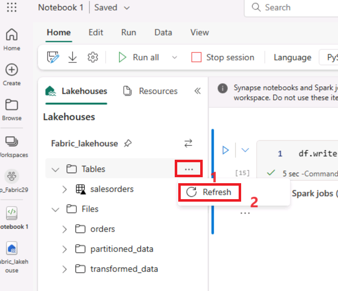
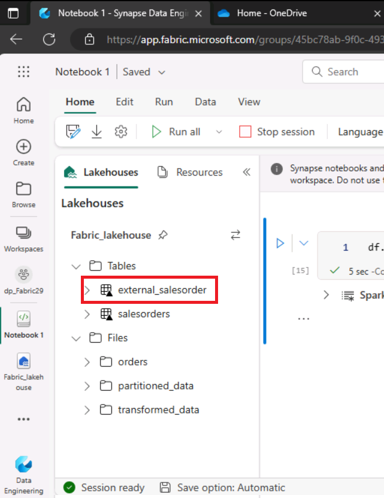
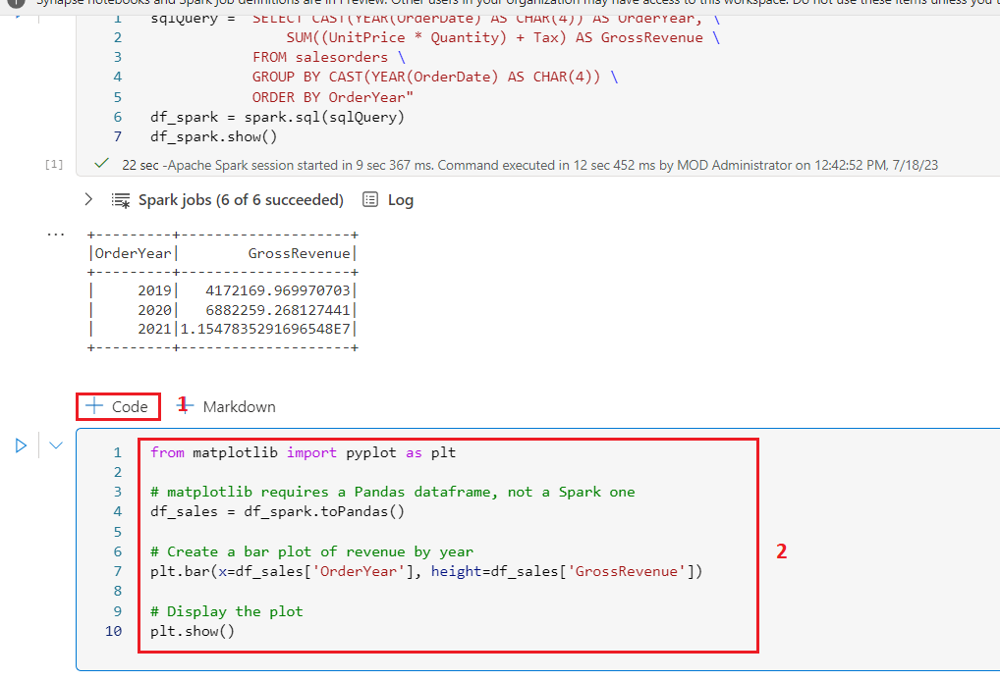
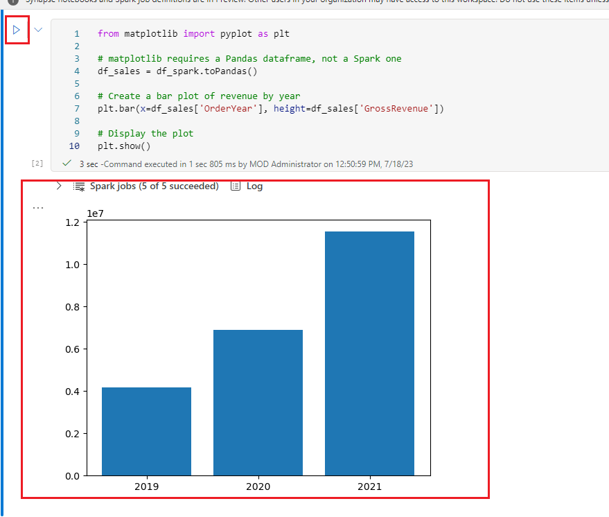
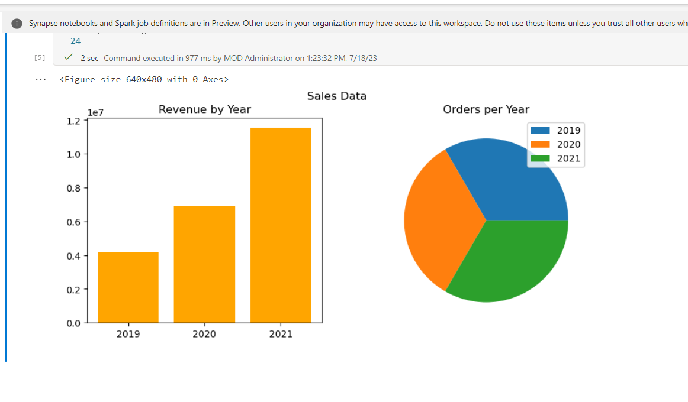
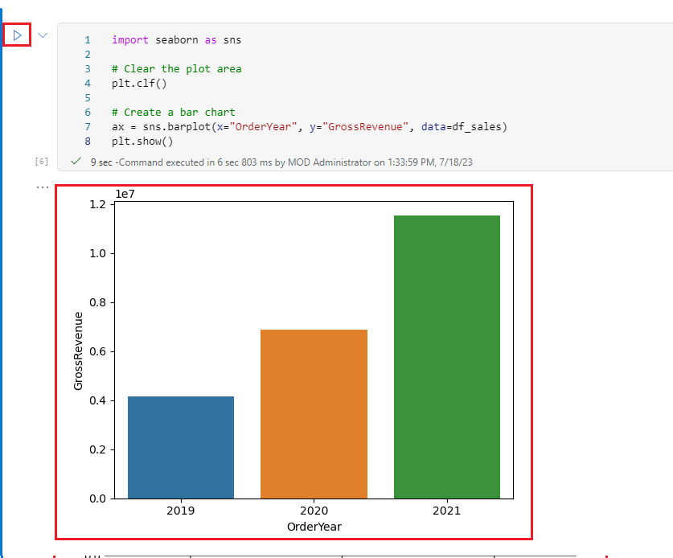
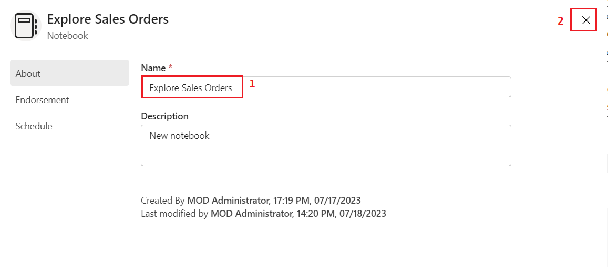
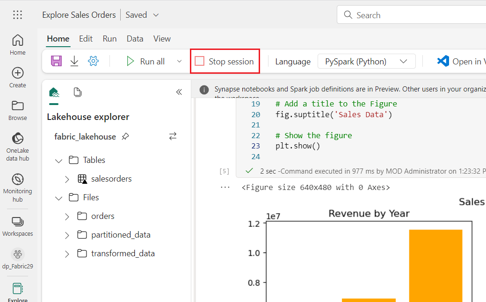
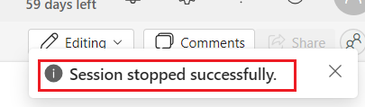

Lab 03-Use delta tables in Apache Spark

**Introduction**

Tables in a Microsoft Fabric lakehouse are based on the open
source *Delta Lake* format for Apache Spark. Delta Lake adds support for
relational semantics for both batch and streaming data operations, and
enables the creation of a Lakehouse architecture in which Apache Spark
can be used to process and query data in tables that are based on
underlying files in a data lake.

**Objectives**

- Create a table in the Spark metastore for structured data management

- Save DataFrame as a managed delta table named "salesorders."

- Save DataFrame as an external delta table named "external_salesorder"
  with a specified path.

- Describe and compare properties of managed and external tables.

- Execute SQL queries on tables for analysis and reporting.

- Visualize data using Python libraries such as matplotlib and seaborn.

**Prerequisites**

- Before starting the Lab 03, complete the Lab 2: Analyze data with
  Apache Spark

# **Exercise 1: Work with tables and SQL**

As you’ve seen, the native methods of the dataframe object enable you to
query and analyze data from a file quite effectively. However, many data
analysts are more comfortable working with tables that they can query
using SQL syntax. Spark provides a *metastore* in which you can define
relational tables. The Spark SQL library that provides the dataframe
object also supports the use of SQL statements to query tables in the
metastore. By using these capabilities of Spark, you can combine the
flexibility of a data lake with the structured data schema and SQL-based
queries of a relational data warehouse - hence the term “data
lakehouse”.

## Task 1: Create a managed table

Tables in a Spark metastore are relational abstractions over files in
the data lake. tables can be *managed* (in which case the files are
managed by the metastore) or *external* (in which case the table
references a file location in the data lake that you manage
independently of the metastore).

1.  Add a new code, click on **+ Code** cell to the notebook and enter
    the following code, which saves the dataframe of sales order data as
    a table named **salesorders**:

> ```CodeCopy
>
> \# Create a new table
>
> df.write.format("delta").saveAsTable("salesorders")
>
> \# Get the table description
>
> spark.sql("DESCRIBE EXTENDED salesorders").show(truncate=False)


**Note**: It’s worth noting a couple of things about this example.
Firstly, no explicit path is provided, so the files for the table will
be managed by the metastore. Secondly, the table is saved
in **delta** format. You can create tables based on multiple file
formats (including CSV, Parquet, Avro, and others) but *delta lake* is a
Spark technology that adds relational database capabilities to tables;
including support for transactions, row versioning, and other useful
features. Creating tables in delta format is preferred for data
lakehouses in Fabric.

2.  **Run** the code cell and review the output, which describes the
    definition of the new table.


3.  In the **Lakehouse** **explorer** pane, in the **…** menu for
    the **Tables** folder, select **Refresh.**


4.  Then, expand the **Tables** node and verify that
    the **salesorders** table has been created.

> 

5.  Hover your mouse beside **salesorders** table, then click on the
    horizontal ellipses (…). Navigate and click on **Load data**, then
    select **Spark**.


6.  Click on **▷ Run cell** button and which uses the Spark SQL library
    to embed a SQL query against the **salesorder** table in PySpark
    code and load the results of the query into a dataframe.

>``` CodeCopy
>
> df = spark.sql("SELECT \* FROM \[your_lakehouse\].salesorders LIMIT
> 1000")
>
> display(df)


## Task 2: Create an external table

You can also create *external* tables for which the schema metadata is
defined in the metastore for the lakehouse, but the data files are
stored in an external location.

1.  Under the results returned by the first code cell, use the **+
    Code** button to add a new code cell if one doesn’t already exist.
    Then enter the following code in the new cell.

>```CodeCopy
> df.write.format("delta").saveAsTable("external_salesorder",
> path="\<abfs_path\>/external_salesorder")


2.  In the **Lakehouse explorer** pane, in the **…** menu for
    the **Files** folder, select **Copy ABFS path** in the notepad.

> The ABFS path is the fully qualified path to the **Files** folder in
> the OneLake storage for your lakehouse - similar to this:

<span class="mark">abfss://dp_Fabric29@onelake.dfs.fabric.microsoft.com/Fabric_lakehouse.Lakehouse/Files/external_salesorder</span>


3.  Now, move into the code cell, replace **\<abfs_path\>** with the
    **path** you copied to the notepad so that the code saves the
    dataframe as an external table with data files in a folder named
    **external_salesorder** in your **Files** folder location. The full
    path should look similar to this

<span class="mark">abfss://dp_Fabric29@onelake.dfs.fabric.microsoft.com/Fabric_lakehouse.Lakehouse/Files/external_salesorder</span>

4.  Use the **▷ (*Run cell*)** button on the left of the cell to run it.


5.  In the **Lakehouse explorer** pane, in the **…** menu for
    the **Tables** folder, select the **Refresh**.



6.  Then expand the **Tables** node and verify that
    the **external_salesorder** table has been created.



7.  In the **Lakehouse explorer** pane, in the **…** menu for
    the **Files** folder, select **Refresh**.


8.  Then expand the **Files** node and verify that
    the **external_salesorder** folder has been created for the table’s
    data files.


## Task 3: Compare managed and external tables

Let’s explore the differences between managed and external tables.

1.  Under the results returned by the code cell, use the **+
    Code** button to add a new code cell. Copy the code below into the
    Code cell and use the **▷ (*Run cell*)** button on the left of the
    cell to run it.

>```Copy
>
> %%sql
>
> DESCRIBE FORMATTED salesorders;


2.  In the results, view the **Location** property for the table, which
    should be a path to the OneLake storage for the lakehouse ending
    with **/Tables/salesorders** (you may need to widen the **Data
    type** column to see the full path).


3.  Modify the **DESCRIBE** command to show the details of
    the **external_saleorder** table as shown here.

4.  Under the results returned by the code cell, use the **+
    Code** button to add a new code cell. Copy the below code and use
    the **▷ (*Run cell*)** button on the left of the cell to run it.

>```Copy
>
> %%sql
>
> DESCRIBE FORMATTED external_salesorder;


5.  In the results, view the **Location** property for the table, which
    should be a path to the OneLake storage for the lakehouse ending
    with **/Files/external_saleorder** (you may need to widen the **Data
    type** column to see the full path).


## Task 4: Run SQL code in a cell

While it’s useful to be able to embed SQL statements into a cell
containing PySpark code, data analysts often just want to work directly
in SQL.

1.  Click on **+ Code** cell to the notebook, and enter the following
    code in it. Click on **▷ Run cell** button and review the results.
    Observe that:

    - The %%sql line at the beginning of the cell (called a *magic*)
      indicates that the Spark SQL language runtime should be used to
      run the code in this cell instead of PySpark.

    - The SQL code references the **salesorders** table that you created
      previously.

    - The output from the SQL query is automatically displayed as the
      result under the cell

>```Copy
>
> %%sql
>
> SELECT YEAR(OrderDate) AS OrderYear,
>
> SUM((UnitPrice \* Quantity) + Tax) AS GrossRevenue
>
> FROM salesorders
>
> GROUP BY YEAR(OrderDate)
>
> ORDER BY OrderYear;


**Note**: For more information about Spark SQL and dataframes, see
the [<u>Spark SQL
documentation</u>](https://spark.apache.org/docs/2.2.0/sql-programming-guide.html).

# Exercise 2: Visualize data with Spark

A picture is proverbially worth a thousand words, and a chart is often
better than a thousand rows of data. While notebooks in Fabric include a
built in chart view for data that is displayed from a dataframe or Spark
SQL query, it is not designed for comprehensive charting. However, you
can use Python graphics libraries like **matplotlib** and **seaborn** to
create charts from data in dataframes.

## Task 1: View results as a chart

1.  Click on **+ Code** cell to the notebook, and enter the following
    code in it. Click on **▷ Run cell** button and observe that it
    returns the data from the **salesorders** view you created
    previously.

>```Copy
>
> %%sql
>
> SELECT \* FROM salesorders


2.  In the results section beneath the cell, change the **View** option
    from **Table** to **Chart**.


3.  Use the **View options** button at the top right of the chart to
    display the options pane for the chart. Then set the options as
    follows and select **Apply**:

    - **Chart type**: Bar chart

    - **Key**: Item

    - **Values**: Quantity

    - **Series Group**: *leave blank*

    - **Aggregation**: Sum

    - **Stacked**: *Unselected*


4.  Verify that the chart looks similar to this


## Task 2: Get started with matplotlib

1.  Click on **+ Code** and copy and paste the below code. **Run** the
    code and observe that it returns a Spark dataframe containing the
    yearly revenue.

>```Copy
>
> sqlQuery = "SELECT CAST(YEAR(OrderDate) AS CHAR(4)) AS OrderYear, \\
>
> SUM((UnitPrice \* Quantity) + Tax) AS GrossRevenue \\
>
> FROM salesorders \\
>
> GROUP BY CAST(YEAR(OrderDate) AS CHAR(4)) \\
>
> ORDER BY OrderYear"
>
> df_spark = spark.sql(sqlQuery)
>
> df_spark.show()


2.  To visualize the data as a chart, we’ll start by using
    the **matplotlib** Python library. This library is the core plotting
    library on which many others are based, and provides a great deal of
    flexibility in creating charts.

3.  Click on **+ Code** and copy and paste the below code.

>```CodeCopy
>
> from matplotlib import pyplot as plt
>
> \# matplotlib requires a Pandas dataframe, not a Spark one
>
> df_sales = df_spark.toPandas()
>
> \# Create a bar plot of revenue by year
>
> plt.bar(x=df_sales\['OrderYear'\], height=df_sales\['GrossRevenue'\])
>
> \# Display the plot
>
> plt.show()



5.  Click on the **Run cell** button and review the results, which
    consist of a column chart with the total gross revenue for each
    year. Note the following features of the code used to produce this
    chart:

    - The **matplotlib** library requires a *Pandas* dataframe, so you
      need to convert the *Spark* dataframe returned by the Spark SQL
      query to this format.

    - At the core of the **matplotlib** library is
      the **pyplot** object. This is the foundation for most plotting
      functionality.

    - The default settings result in a usable chart, but there’s
      considerable scope to customize it



6.  Modify the code to plot the chart as follows, replace all the code
    in the **cell** with the following code and click on **▷ Run
    cell** button and review the output

>```Copy
>
> from matplotlib import pyplot as plt
>
> \# Clear the plot area
>
> plt.clf()
>
> \# Create a bar plot of revenue by year
>
> plt.bar(x=df_sales\['OrderYear'\], height=df_sales\['GrossRevenue'\],
> color='orange')
>
> \# Customize the chart
>
> plt.title('Revenue by Year')
>
> plt.xlabel('Year')
>
> plt.ylabel('Revenue')
>
> plt.grid(color='#95a5a6', linestyle='--', linewidth=2, axis='y',
> alpha=0.7)
>
> plt.xticks(rotation=45)
>
> \# Show the figure
>
> plt.show()


7.  The chart now includes a little more information. A plot is
    technically contained with a **Figure**. In the previous examples,
    the figure was created implicitly for you; but you can create it
    explicitly.

8.  Modify the code to plot the chart as follows, replace all the code
    in the **cell** with the following code.

>```Copy
>
> from matplotlib import pyplot as plt
>
> \# Clear the plot area
>
> plt.clf()
>
> \# Create a Figure
>
> fig = plt.figure(figsize=(8,3))
>
> \# Create a bar plot of revenue by year
>
> plt.bar(x=df_sales\['OrderYear'\], height=df_sales\['GrossRevenue'\],
> color='orange')
>
> \# Customize the chart
>
> plt.title('Revenue by Year')
>
> plt.xlabel('Year')
>
> plt.ylabel('Revenue')
>
> plt.grid(color='#95a5a6', linestyle='--', linewidth=2, axis='y',
> alpha=0.7)
>
> plt.xticks(rotation=45)
>
> \# Show the figure
>
> plt.show()


9.  **Re-run** the code cell and view the results. The figure determines
    the shape and size of the plot.

    A figure can contain multiple subplots, each on its own *axis*.


10. Modify the code to plot the chart as follows. **Re-run** the code
    cell and view the results. The figure contains the subplots
    specified in the code.

>```Copy
>
> from matplotlib import pyplot as plt
>
> \# Clear the plot area
>
> plt.clf()
>
> \# Create a figure for 2 subplots (1 row, 2 columns)
>
> fig, ax = plt.subplots(1, 2, figsize = (10,4))
>
> \# Create a bar plot of revenue by year on the first axis
>
> ax\[0\].bar(x=df_sales\['OrderYear'\],
> height=df_sales\['GrossRevenue'\], color='orange')
>
> ax\[0\].set_title('Revenue by Year')
>
> \# Create a pie chart of yearly order counts on the second axis
>
> yearly_counts = df_sales\['OrderYear'\].value_counts()
>
> ax\[1\].pie(yearly_counts)
>
> ax\[1\].set_title('Orders per Year')
>
> ax\[1\].legend(yearly_counts.keys().tolist())
>
> \# Add a title to the Figure
>
> fig.suptitle('Sales Data')
>
> \# Show the figure
>
> plt.show()




**Note**: To learn more about plotting with matplotlib, see
the [<u>matplotlib documentation</u>](https://matplotlib.org/).

## Task 3: Use the seaborn library

While **matplotlib** enables you to create complex charts of multiple
types, it can require some complex code to achieve the best results. For
this reason, over the years, many new libraries have been built on the
base of matplotlib to abstract its complexity and enhance its
capabilities. One such library is **seaborn**.

1.  Click on **+ Code** and copy and paste the below code.

>```Copy
>
> import seaborn as sns
>
> \# Clear the plot area
>
> plt.clf()
>
> \# Create a bar chart
>
> ax = sns.barplot(x="OrderYear", y="GrossRevenue", data=df_sales)
>
> plt.show()


2.  **Run** the code and observe that it displays a bar chart using the
    seaborn library.



3.  **Modify** the code as follows. **Run** the modified code and note
    that seaborn enables you to set a consistent color theme for your
    plots.

>'``Copy
>
> import seaborn as sns
>
> \# Clear the plot area
>
> plt.clf()
>
> \# Set the visual theme for seaborn
>
> sns.set_theme(style="whitegrid")
>
> \# Create a bar chart
>
> ax = sns.barplot(x="OrderYear", y="GrossRevenue", data=df_sales)
>
> plt.show()

 

4.  **Modify** the code again as follows. **Run** the modified code to
    view the yearly revenue as a line chart.

>```Copy
>
> import seaborn as sns
>
> \# Clear the plot area
>
> plt.clf()
>
> \# Create a bar chart
>
> ax = sns.lineplot(x="OrderYear", y="GrossRevenue", data=df_sales)
>
> plt.show()


**Note**: To learn more about plotting with seaborn, see the [<u>seaborn
documentation</u>](https://seaborn.pydata.org/index.html).

## Task 4: Use delta tables for streaming data

Delta lake supports streaming data. Delta tables can be a *sink* or
a *source* for data streams created using the Spark Structured Streaming
API. In this example, you’ll use a delta table as a sink for some
streaming data in a simulated internet of things (IoT) scenario.

1.  Click on **+ Code** and copy and paste the below code and then click
    on **Run cell** button.

>```Copy
>
> from notebookutils import mssparkutils
>
> from pyspark.sql.types import \*
>
> from pyspark.sql.functions import \*
>
> \# Create a folder
>
> inputPath = 'Files/data/'
>
> mssparkutils.fs.mkdirs(inputPath)
>
> \# Create a stream that reads data from the folder, using a JSON
> schema
>
> jsonSchema = StructType(\[
>
> StructField("device", StringType(), False),
>
> StructField("status", StringType(), False)
>
> \])
>
> iotstream =
> spark.readStream.schema(jsonSchema).option("maxFilesPerTrigger",
> 1).json(inputPath)
>
> \# Write some event data to the folder
>
> device_data = '''{"device":"Dev1","status":"ok"}
>
> {"device":"Dev1","status":"ok"}
>
> {"device":"Dev1","status":"ok"}
>
> {"device":"Dev2","status":"error"}
>
> {"device":"Dev1","status":"ok"}
>
> {"device":"Dev1","status":"error"}
>
> {"device":"Dev2","status":"ok"}
>
> {"device":"Dev2","status":"error"}
>
> {"device":"Dev1","status":"ok"}'''
>
> mssparkutils.fs.put(inputPath + "data.txt", device_data, True)
>
> print("Source stream created...")


2.  Ensure the message ***Source stream created…*** is printed. The code
    you just ran has created a streaming data source based on a folder
    to which some data has been saved, representing readings from
    hypothetical IoT devices.

3.  Click on **+ Code** and copy and paste the below code and then click
    on **Run cell** button.

>```Copy
>
> \# Write the stream to a delta table
>
> delta_stream_table_path = 'Tables/iotdevicedata'
>
> checkpointpath = 'Files/delta/checkpoint'
>
> deltastream =
> iotstream.writeStream.format("delta").option("checkpointLocation",
> checkpointpath).start(delta_stream_table_path)
>
> print("Streaming to delta sink...")


4.  This code writes the streaming device data in delta format to a
    folder named **iotdevicedata**. Because the path for the folder
    location is in the **Tables** folder, a table will automatically be
    created for it. Click on the horizontal ellipses beside table, then
    click on **Refresh**.


5.  Click on **+ Code** and copy and paste the below code and then click
    on **Run cell** button.

>```Copy
>
> %%sql
>
> SELECT \* FROM IotDeviceData;


6.  This code queries the **IotDeviceData** table, which contains the
    device data from the streaming source.

7.  Click on **+ Code** and copy and paste the below code and then click
    on **Run cell** button.

>```Copy
> \# Add more data to the source stream
>
> more_data = '''{"device":"Dev1","status":"ok"}
>
> {"device":"Dev1","status":"ok"}
>
> {"device":"Dev1","status":"ok"}
>
> {"device":"Dev1","status":"ok"}
>
> {"device":"Dev1","status":"error"}
>
> {"device":"Dev2","status":"error"}
>
> {"device":"Dev1","status":"ok"}'''
>
> mssparkutils.fs.put(inputPath + "more-data.txt", more_data, True)


8.  This code writes more hypothetical device data to the streaming
    source.

9.  Click on **+ Code** and copy and paste the below code and then click
    on **Run cell** button.

>```Copy
> %%sql
>
> SELECT \* FROM IotDeviceData;
>
>  alt="A screenshot of a computer Description automatically generated" />

10. This code queries the **IotDeviceData** table again, which should
    now include the additional data that was added to the streaming
    source.

11. Click on **+ Code** and copy and paste the below code and then click
    on **Run cell** button.

>```CodeCopy
> deltastream.stop()


12. This code stops the stream.

## Task 5: Save the notebook and end the Spark session

Now that you’ve finished working with the data, you can save the
notebook with a meaningful name and end the Spark session.

1.  In the notebook menu bar, use the ⚙️ **Settings** icon to view the
    notebook settings.


2.  Set the **Name** of the notebook to ++**Explore Sales Orders++**,
    and then close the settings pane.



3.  On the notebook menu, select **Stop session** to end the Spark
    session.





**Summary**:

In this practical lab, participants will engage in a series of tasks
focused on working with delta tables in Microsoft Fabric. The tasks
encompass uploading and exploring data, creating managed and external
delta tables, comparing their properties, the lab introduces SQL
capabilities for managing structured data and provides insights on data
visualization using Python libraries like matplotlib and seaborn. The
exercises aim to provide a comprehensive understanding of utilizing
Microsoft Fabric for data analysis, and incorporating delta tables for
streaming data in an IoT context.
