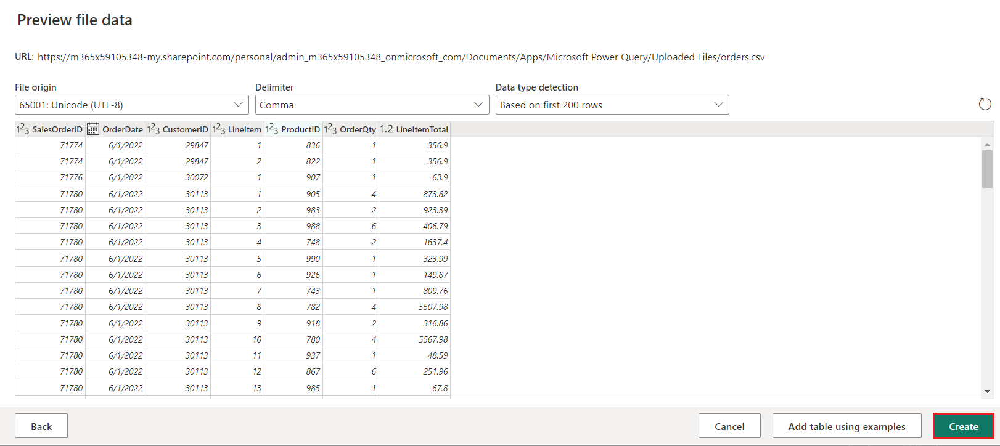
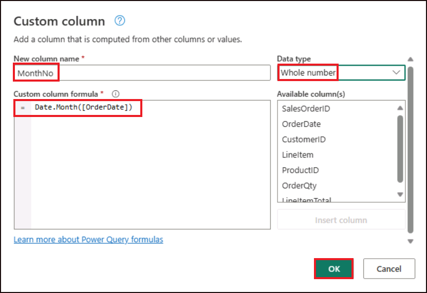
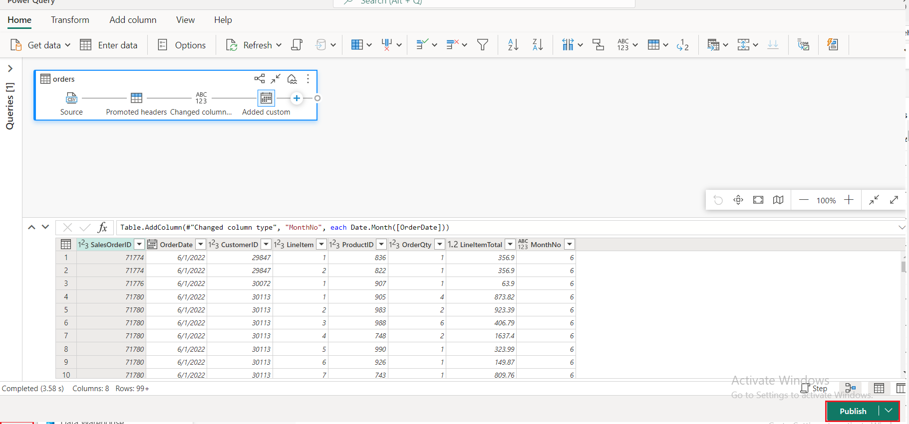
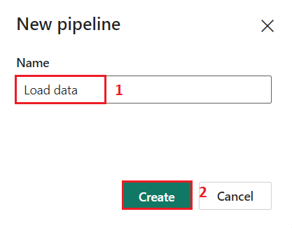
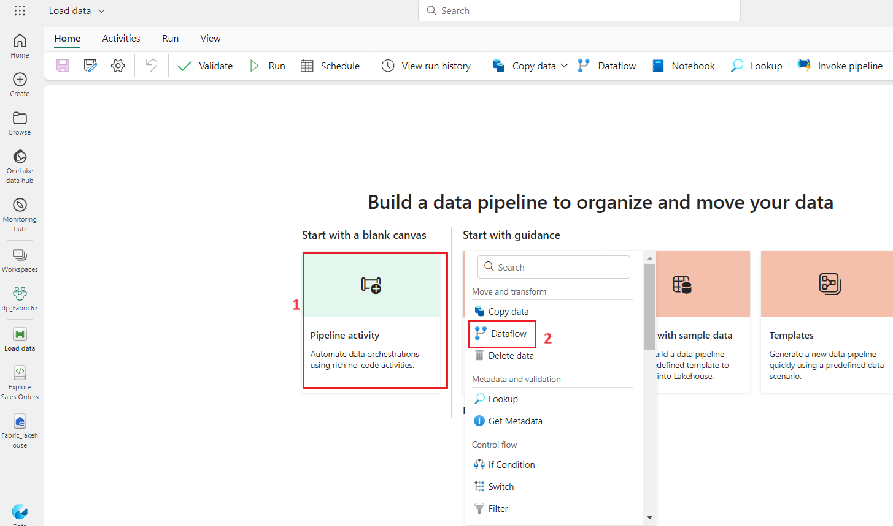
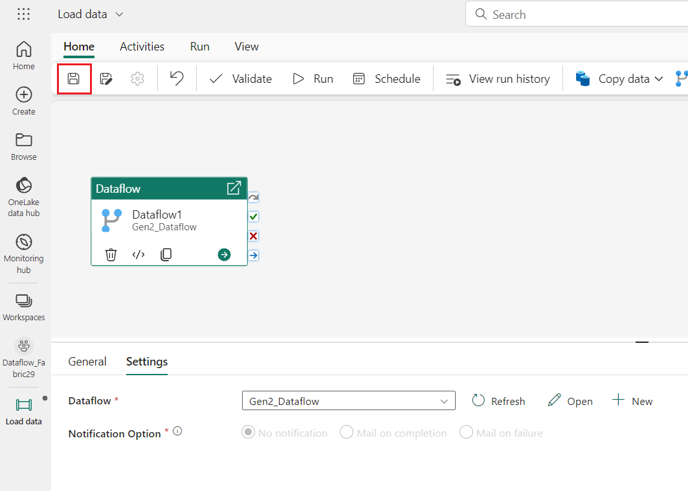

Lab 04-Create a Dataflow (Gen2) in Microsoft Fabric

**Introduction**

In Microsoft Fabric, Dataflows (Gen2) connect to various data sources
and perform transformations in Power Query Online. They can then be used
in Data Pipelines to ingest data into a lakehouse or other analytical
store, or to define a dataset for a Power BI report.

This lab is designed to introduce the different elements of Dataflows
(Gen2), and not create a complex solution that may exist in an
enterprise.

**Objectives**

- Establish a data lakehouse in the Data Engineering experience and
  ingest relevant data for subsequent analysis.

- Define a dataflow for extracting, transforming, and loading data into
  the lakehouse.

- Configure data destinations within Power Query to store the
  transformed data in the lakehouse.

- Incorporate the dataflow into a pipeline to enable scheduled data
  processing and ingestion.

- Remove the workspace and associated elements to conclude the exercise.

**Prerequisites**

- Before starting the Lab 04, complete the **Lab 02: Analyze data with
  Apache Spark** and **Lab 03-Use delta tables in Apache Spark**

# Exercise 1: Create a Dataflow (Gen2) in Microsoft Fabric

In Microsoft Fabric, Dataflows (Gen2) connect to various data sources
and perform transformations in Power Query Online. They can then be used
in Data Pipelines to ingest data into a lakehouse or other analytical
store, or to define a dataset for a Power BI report.

This exercise is designed to introduce the different elements of
Dataflows (Gen2), and not create a complex solution that may exist in an
enterprise

## Task 1: Create a Dataflow (Gen2) to ingest data

Now that you have a lakehouse, you need to ingest some data into it. One
way to do this is to define a dataflow that encapsulates an *extract,
transform, and load* (ETL) process.

1.  Now, click on **Fabric_lakehouse** on the left-sided navigation
    pane.

2.  In the **Fabric_lakehouse** home page, click on the drop-down arrow
    in the **Get data** and select **New Dataflow Gen2.** The Power
    Query editor for your new dataflow opens.

3.  In the **Power Query** pane under the **Home tab**, click on
    **Import from a Text/CSV file**.

4.  In the **Connect to data source** pane, under **Connection
    settings**, select **Upload file (Preview)** radio button, then
    click on **Browse** button and browse your VM **C:\LabFiles**, then
    select the **orders file** and click on the **Open** button.

5.  In the **Connect to data source** pane, under **Connection
    credentials,** enter the following details and click on the **Next**
    button.

    - **Connection**: Create new connection

    - **data gateway**: (none)

    - **Authentication kind**: Organizational account

6.  In **Preview file data** pane, click on **Create** to create the
    data source.
    

7.  The **Power Query** editor shows the data source and an initial set
    of query steps to format the data.

8.  On the toolbar ribbon, select the **Add column** tab. Then,
    select **Custom column.**

 

9.  Set the New column name to **MonthNo** , set the Data type to
    **Whole Number** and then add the following
    formula:**Date.Month(\[OrderDate\])** under **Custom column
    formula**. Select **OK**.

10. Notice how the step to add the custom column is added to the query.
    The resulting column is displayed in the data pane.

**Tip:** In the Query Settings pane on the right side, notice
the **Applied Steps** include each transformation step. At the bottom,
you can also toggle the **Diagram flow** button to turn on the Visual
Diagram of the steps.

Steps can be moved up or down, edited by selecting the gear icon, and
you can select each step to see the transformations apply in the preview
pane.

Task 2: Add data destination for Dataflow

1.  On the **Power Query** toolbar ribbon, select the **Home** tab. Then
    in the D**ata destination** drop-down menu, select **Lakehouse**(if
    not selected already).

**Note:** If this option is grayed out, you may already have a data
destination set. Check the data destination at the bottom of the Query
settings pane on the right side of the Power Query editor. If a
destination is already set, you can change it using the gear.

2.  Click on the **Settings** icon next to the selected **Lakehouse**
    option.

3.  In the **Connect to data destination** dialog box, select **Edit
    connection.**

4.  In the **Connect to data destination** dialog box, select **sign
    in** using your Power BI organizational account to set the identity
    that the dataflow uses to access the lakehouse.

5.  In Connect to data destination dialog box, select **Next**

6.  In Connect to data destination dialog box, select **New table**.
    Click on the **Lakehouse folder** ,select your workspace –
    **dp_FabricXX** and then select your lakehouse i.e
    **Fabric_lakehouse.** Then specify the Table name as **orders** and
    select **Next** button.

7.  In the **Choose destination settings** dialog box, under **Use
    automatic settings off** and the **Update method** select **Append**
    ,then click on the **Save settings** button.

8.  The **Lakehouse** destination is indicated as an **icon** in the
    **query** in the Power Query editor.

9.  Select **Publish** to publish the dataflow. Then wait for
    the **Dataflow 1** dataflow to be created in your workspace.

10. Once published, you can right-click on the dataflow in your
    workspace, select **Properties**, and rename your dataflow.

11. In the **Dataflow1** dialog box, enter the **Name** as
    **Gen2_Dataflow** and click on **Save** button.

## Task 3: Add a dataflow to a pipeline

You can include a dataflow as an activity in a pipeline. Pipelines are
used to orchestrate data ingestion and processing activities, enabling
you to combine dataflows with other kinds of operation in a single,
scheduled process. Pipelines can be created in a few different
experiences, including Data Factory experience.

1.  In the Synapse Data Engineering Home page , Under **dp_FabricXX**
    pane, select **+New** -\> **Data pipeline**

2.  In the **New pipeline** dialog box, enter **Load data** in
    the **Name** field, click on the **Create** button to open the new
    pipeline.

3.  The pipeline editor opens.

> **Tip**: If the Copy Data wizard opens automatically, close it!

4.  Select **Pipeline activity**, and add a **Dataflow** activity to the
    pipeline.

5.  With the new **Dataflow1** activity selected, on
    the **Settings** tab, in the **Dataflow** drop-down list,
    select **Gen2_Dataflow** (the data flow you created previously)

6.  On the **Home** tab, save the pipeline using the **🖫 (*Save*)**
    icon.

7.  Use the **▷ Run** button to run the pipeline, and wait for it to
    complete. It may take a few minutes.

>  alt="A screenshot of a computer Description automatically generated" />
>
>  alt="A screenshot of a computer Description automatically generated" />

8.  In the menu bar on the left edge, select your workspace i.e
    **dp_FabricXX**.

9.  In the **Fabric_lakehouse** pane, select the
    **Gen2_FabricLakehouse** of type Lakehouse.

10. In **Explorer** pane, select the **…** menu for **Tables**,
    select **refresh**. Then expand **Tables** and select
    the **orders** table, which has been created by your dataflow.

**Tip**: Use the Power BI Desktop *Dataflows
connector* to connect directly to the data transformations done with
your dataflow.

You can also make additional transformations, publish
as a new dataset, and distribute with intended audience for specialized
datasets.

## Task 4: Clean up resources

In this exercise, you’ve learned how to use Spark to work with data in
Microsoft Fabric.

If you’ve finished exploring your lakehouse, you can delete the
workspace you created for this exercise.

1.  In the bar on the left, select the icon for your workspace to view
    all of the items it contains.

>  alt="A screenshot of a computer Description automatically generated" />

2.  In the **…** menu on the toolbar, select **Workspace settings**.

3.  In the **Other** section, select **Remove this workspace**.

4.  In the **Delete workspace?** dialog box, click on the **Delete**
    button.

>  alt="A screenshot of a computer Description automatically generated" />
>
>  alt="A screenshot of a computer Description automatically generated" />

**Summary**

This practical lab guides you through the process of setting up a Fabric
workspace, creating a data lakehouse, and ingesting data for analysis.
It demonstrates how to define a dataflow to handle ETL operations and
configure data destinations for storing the transformed data.
Additionally, you'll learn how to integrate the dataflow into a pipeline
for automated processing. Finally, you'll be provided with instructions
to clean up resources once the exercise is complete.

This lab equips you with essential skills for working with Fabric,
enabling you to create and manage workspaces, establish data lakehouses,
and perform data transformations efficiently. By incorporating dataflows
into pipelines, you'll learn how to automate data processing tasks,
streamlining your workflow and enhancing productivity in real-world
scenarios. The cleanup instructions ensure you leave no unnecessary
resources, promoting an organized and efficient workspace management
approach.
