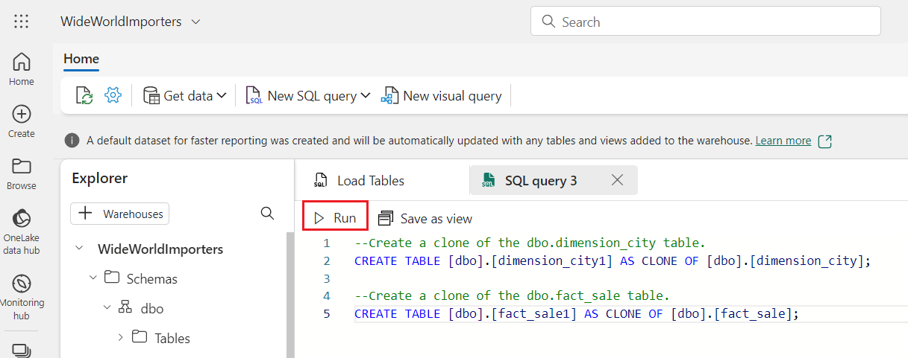
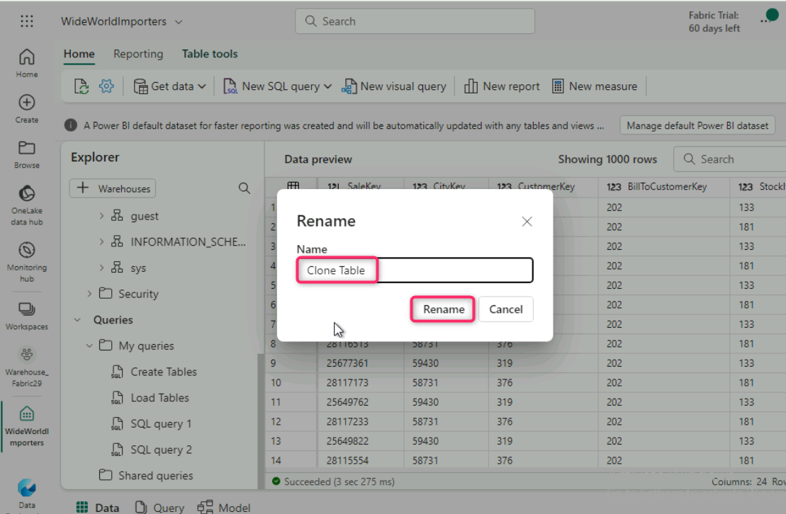
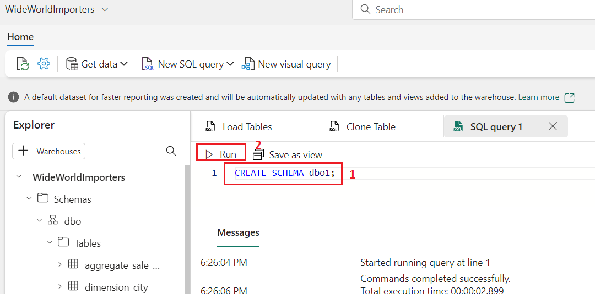
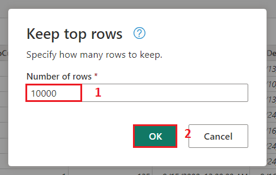

# *Lab 05-Building a data warehouse in Microsoft Fabric*


**Introduction**

While many concepts in Microsoft Fabric may be familiar to data and
analytics professionals, it can be challenging to apply those concepts
in a new environment. This lab has been designed to walk step-by-step
through an end-to-end scenario from data acquisition to data consumption
to build a basic understanding of the Microsoft Fabric user experience,
the various experiences and their integration points, and the Microsoft
Fabric professional and citizen developer experiences.

**Objectives**

- Set up a Fabric workspace with trial enabled.

- Establish a new Warehouse named WideWorldImporters in Microsoft
  Fabric.

- Load data into the Warehouse_FabricXX workspace using a Data Factory
  pipeline.

- Generate dimension_city and fact_sale tables within the data
  warehouse.

- Populate dimension_city and fact_sale tables with data from Azure Blob
  Storage.

- Create clones of dimension_city and fact_sale tables in the Warehouse.

- Clone dimension_city and fact_sale tables into the dbo1 schema.

- Develop a stored procedure to transform data and create
  aggregate_sale_by_date_city table.

- Generate a query using the visual query builder to merge and aggregate
  data.

- Use a notebook to query and analyze data from the dimension_customer
  table.

- Include WideWorldImporters and ShortcutExercise warehouses for
  cross-querying.

- Execute a T-SQL query across WideWorldImporters and ShortcutExercise
  warehouses.

- Enable Azure Maps visual integration in the Admin portal.

- Generate column chart, map, and table visuals for Sales Analysis
  report.

- Create a report using data from the WideWorldImporters dataset in the
  OneLake data hub.

- Remove the workspace and its associated items.

## Task 1: Create a workspace

Before working with data in Fabric, create a workspace with the Fabric
trial enabled.

1.  Open your browser, navigate to the address bar, and type or paste
    the following URL: <https://app.fabric.microsoft.com/> then press
    the **Enter** button.

**Note**: If you are directed to the Microsoft Fabric Home page, then
skip steps from \#2 to \#4.

>  alt="A screenshot of a computer Description automatically generated" />

2.  In the **Microsoft Fabric** window, enter your credentials, and
    click on the **Submit** button.

>  alt="A close up of a white and green object Description automatically generated" />

3.  Then, In the **Microsoft** window enter the password and click on
    the **Sign in** button**.**

>  alt="A login screen with a red box and blue text Description automatically generated" />

4.  In **Stay signed in?** window, click on the **Yes** button.

>  alt="A screenshot of a computer error Description automatically generated" />

5.  On the **Microsoft Fabric** home page, select the **Power BI**
    template.

>  style="width:6.49167in;height:4.20833in" />

6.  In the **Power BI Home** page menu bar on the left,
    select **Workspaces** (the icon looks similar to 🗇).

> 

7.  In the Workspaces pane Select **+** **New workspace**.

>  alt="A screenshot of a computer Description automatically generated" />

8.  In the **Create a workspace tab**, enter the following details and
    click on the **Apply** button.

| **Name** | ***Warehouse_FabricXX** (*XX can be a unique number) (here, we entered ***Warehouse_Fabric29)*** |
|----|----|
| **Description** | This workspace contains all the artifacts for the data warehouse |
| **Advanced** | Under **License mode**, select **Trial** |
| **Default storage format** | **Small dataset storage format** |

>  style="width:5.04735in;height:5.69864in" />


9.  Wait for the deployment to complete. It takes 2-3 minutes to
    complete. When your new workspace opens, it should be empty.


10. In the **Power BI Fabric Lakehouse Tutorial-XX** page, click on the
    **Data Warehouse** icon located at the bottom left and select **Data
    Warehouse** under Datascience.

> 

## Task 2: Create a Warehouse in Microsoft Fabric

1.  In the **Synapse** **Data Warehouse** page, select **Warehouse** to
    create a lakehouse.

> 

2.  On the **New warehouse** dialog, enter **WideWorldImporters** and
    click on the **Create** button.

>  style="width:3.47708in;height:1.82569in" />

3.  When provisioning is complete, the **WideWorldImporters**
    warehouse landing page appears.


## Task 3: Ingest data into a Warehouse in Microsoft Fabric

1.  From the **WideWorldImporters** warehouse landing page,
    select **Warehouse_FabricXX** in the left-sided navigation menu to
    return to the workspace item list.

>  style="width:3.88068in;height:4.4276in" />
>
>  style="width:6.99428in;height:3.94997in" />

2.  In the **Warehouse_FabricXX** page, click on the +**New** dropdown.
    Then, click on **More options** to view the full list of available
    items.

>  style="width:6.49167in;height:6.71667in" />

3.  In the **Warehouse_FabricXX** page, navigate to the **Data
    Factory** section and click on **Data pipeline.**

> 

4.  On the **New** **pipeline** dialog box, in the **Name** field, enter
    **Load Customer Data** and click on the **Create** button.

> 

5.  In the **Load Customer Data** page, navigate to **Start building
    your data pipeline** section and click on **Pipeline activity**.

>  style="width:6.49167in;height:3.35833in" />

6.  Navigate and select **Copy data** under **Move
    &** **transform** section.

>  style="width:6.52083in;height:3.99286in" />

7.  Select the newly created **Copy data** **1** activity from the
    design canvas to configure it.

> **Note**: Drag the horizonal line in the design canvas to have a
> complete view of various features.
>
>  style="width:6.49236in;height:5.16667in" />

8.  On the **General** tab, in the **Name** field**,** enter **CD Load
    dimension_customer** .

>  style="width:4.58523in;height:4.08252in" />

9.  Click on the **Source** tab, select **External** radio button for
    the **Data store type**. In the **Connection** row**,**
    select +**New** to create a new connection.


10. On the **New connection** window, under **All** tab, navigate and
    select **Azure Blob Storage**, then click on the **Continue**
    button.


11. On the **Connection settings** pane that appears on the right side,
    configure the following settings and click on the **Create** button.

- In the **Account name or URL**,
  enter **https://azuresynapsestorage.blob.core.windows.net/sampledata/**.

<!-- -->

- In the **Connection credentials** section, click on the dropdown under
  **Connection**, then select **Create new connection**.

<!-- -->

- In **Connection name** field**,** enter !! **Wide World Importers
  Public Sample !!**.

<!-- -->

- Set the **Authentication kind** to **Anonymous**.


12. Change the remaining settings on the **Source** page of the copy
    activity as follows to reach the .parquet files
    in **https://azuresynapsestorage.blob.core.windows.net/sampledata/WideWorldImportersDW/parquet/full/dimension_city/\*.parquet**

13. In the **File path** text boxes, provide:

- **Container:** **sampledata**

<!-- -->

- **File path - Directory:** **WideWorldImportersDW/tables**

<!-- -->

- **File path - File name:** **dimension_customer.parquet**

  - In the **File format** drop down, choose **Parquet** (if you are
    unable to see **Parquet**, then type in the search box and then
    select it)


14. Click on **Preview data** on the right side of **File path** setting
    to ensure that there are no errors and then click on **close.**


15. On the **Destination** tab, enter the following settings.

<table>
<colgroup>
<col style="width: 36%" />
<col style="width: 63%" />
</colgroup>
<thead>
<tr class="header">
<th><strong>Data store type</strong></th>
<th><strong>Workspace</strong></th>
</tr>
</thead>
<tbody>
<tr class="odd">
<td><strong>Workspace data store type</strong></td>
<td><strong>Warehouse</strong></td>
</tr>
<tr class="even">
<td><strong>Data Warehouse</strong></td>
<td>drop down, select <strong>WideWorldImporters</strong> from the
list</td>
</tr>
<tr class="odd">
<td><strong>Table option</strong></td>
<td><strong>Auto create table</strong></td>
</tr>
<tr class="even">
<td><strong>Table</strong></td>
<td><ul>
<li><p>In the first box enter <strong>dbo</strong></p></li>
<li><p>In the second box enter
<strong>dimension_customer</strong></p></li>
</ul></td>
</tr>
</tbody>
</table>


16. From the ribbon, select **Run**.

>  style="width:6.49236in;height:4.18194in" />

17. In the **Save and run?** dialog box, click on **Save and run**
    button.

>  style="width:3.47708in;height:2.14375in" />
>
>  alt="A screenshot of a computer Description automatically generated" />
>
>  alt="A screenshot of a computer Description automatically generated" />

18. Monitor the copy activity's progress on the **Output** page and wait
    for it to complete.

>  alt="A screenshot of a computer Description automatically generated" />

## Task 4: Create tables in a data warehouse

1.  On **Load Customer Data** page, click on **Warehouse_FabricXX**
    workspace in the left-sided navigation bar.

>  style="width:3.88826in;height:4.12254in" />

2.  In the **Syanapse Data Engineering** **Warehouse_FabricXX** page,
    carefully navigate and click on **WideWorldImporters** having
    **Warehouse** type as shown in the below image.


3.  In the **WideWorldImporters** page, click on **New SQL query**.

>  style="width:6.18208in;height:3.42614in" />

4.  In the query editor, paste the following code and select **Run** to
    execute the query

>```Copy
> /*
> 1. Drop the dimension_city table if it already exists.
> 2. Create the dimension_city table.
> 3. Drop the fact_sale table if it already exists.
> 4. Create the fact_sale table.
> */
>
> --dimension_city
> DROP TABLE IF EXISTS [dbo].[dimension_city];
> CREATE TABLE [dbo].[dimension_city]
 >   (
  >      [CityKey] [int] NULL,
   >      [WWICityID] [int] NULL,
   >      [City] [varchar](8000) NULL,
 >      [StateProvince] [varchar](8000) NULL,
  >      [Country] [varchar](8000) NULL,
  >      [Continent] [varchar](8000) NULL,
  >      [SalesTerritory] [varchar](8000) NULL,
   >      [Region] [varchar](8000) NULL,
   >      [Subregion] [varchar](8000) NULL,
   >      [Location] [varchar](8000) NULL,
   >      [LatestRecordedPopulation] [bigint] NULL,
   >      [ValidFrom] [datetime2](6) NULL,
    >      [ValidTo] [datetime2](6) NULL,
  >      [LineageKey] [int] NULL
  >  );
>
>--fact_sale
>
>DROP TABLE IF EXISTS [dbo].[fact_sale];
>
>CREATE TABLE [dbo].[fact_sale]
>
  >  (
  >      [SaleKey] [bigint] NULL,
   >      [CityKey] [int] NULL,
  >      [CustomerKey] [int] NULL,
  >      [BillToCustomerKey] [int] NULL,
  >      [StockItemKey] [int] NULL,
   >      [InvoiceDateKey] [datetime2](6) NULL,
   >      [DeliveryDateKey] [datetime2](6) NULL,
   >      [SalespersonKey] [int] NULL,
   >      [WWIInvoiceID] [int] NULL,
   >      [Description] [varchar](8000) NULL,
   >      [Package] [varchar](8000) NULL,
   >      [Quantity] [int] NULL,
   >      [UnitPrice] [decimal](18, 2) NULL,
   >      [TaxRate] [decimal](18, 3) NULL,
   >      [TotalExcludingTax] [decimal](29, 2) NULL,
   >      [TaxAmount] [decimal](38, 6) NULL,
   >      [Profit] [decimal](18, 2) NULL,
   >      [TotalIncludingTax] [decimal](38, 6) NULL,
   >      [TotalDryItems] [int] NULL,
   >      [TotalChillerItems] [int] NULL,
   >      [LineageKey] [int] NULL,
   >      [Month] [int] NULL,
   >      [Year] [int] NULL,
   >      [Quarter] [int] NULL
   > );

>
>  style="width:6.49236in;height:4.68958in" />
>
>  alt="A screenshot of a computer Description automatically generated" />

5.  To save this query, right-click on the **SQL query 1** tab just
    above the editor and select **Rename**.

>  style="width:6.49167in;height:4.90833in" />

6.  In the **Rename** dialog box, under **Name** field, enter **Create
    Tables** to change the name of **SQL query 1**. Then, click on the
    **Rename** button.

> 

7.  Click on the **Refresh icon** below the **Home** tab, as shown in
    the below image.

>  style="width:5.30492in;height:3.2822in" />

8.  In the **Explorer** pane, you’ll see the **fact_sale** table
    and **dimension_city** table.

>  style="width:4.49474in;height:5.08523in" />

## Task 5: Load data using T-SQL

Now that you know how to build a data warehouse, load a table, and
generate a report, it's time to extend the solution by exploring other
methods for loading data.

1.  In the **WideWorldImporters** page, click on **New SQL query** in
    the command bar**.**

> 

2.  In the query editor, **paste** the following code, then click on
    **Run** to execute the query.

> ```SQLCopy
>--Copy data from the public Azure storage account to the dbo.>dimension_city table.
>COPY INTO [dbo].[dimension_city]
>FROM 'https://azuresynapsestorage.blob.core.windows.net/sampledata/WideWorldImportersDW/tables/dimension_city.parquet'
>WITH (FILE_TYPE = 'PARQUET');
>
>--Copy data from the public Azure storage account to the dbo.fact_sale table.
> COPY INTO [dbo].[fact_sale]
>FROM 
>'https://azuresynapsestorage.blob.core.windows.net/sampledata/WideWorldImportersDW/tables/fact_sale.parquet'
>WITH (FILE_TYPE = 'PARQUET');


3.  After the query is completed, review the messages, which indicats
    the number of rows that were loaded into the **dimension_city** and
    **fact_sale** tables respectively.


4.  Load the data preview to validate the data loaded successfully by
    selecting on the **fact_sale** table in the **Explorer**.


5.  Rename the query. Right-click on **SQL query 1** in
    the **Explorer**, then select **Rename**.


6.  In the **Rename** dialog box, under the **Name** field, enter **Load
    Tables**. Then, click on **Rename** button.


7.  Click on the **Refresh** icon in the command bar below the **Home**
    tab.


## Task 6: Clone table using T-SQL in Microsoft Fabric

This task guides you through creating a [table
clone](https://learn.microsoft.com/en-in/fabric/data-warehouse/clone-table) in
Warehouse in Microsoft Fabric, using the [CREATE TABLE AS CLONE
OF](https://learn.microsoft.com/en-us/sql/t-sql/statements/create-table-as-clone-of-transact-sql?view=fabric&preserve-view=true) T-SQL
syntax.

1.  Create a table clone within the same schema in a warehouse.

2.  In the **WideWorldImporter** page, click on the **New SQL query** in
    the command bar**.**

> 

3.  In the query editor, paste the following code to create clones of
    the **dbo.dimension_city** and **dbo.fact_sale** tables.

> ```SQLCopy
> --Create a clone of the dbo.dimension_city table.
>CREATE TABLE [dbo].[dimension_city1] AS CLONE OF [dbo].[dimension_city];
>
>--Create a clone of the dbo.fact_sale table.
>CREATE TABLE [dbo].[fact_sale1] AS CLONE OF [dbo].[fact_sale];


4.  Select **Run** to execute the query. The query takes a few seconds
    to execute. After the query is completed, the table clones
    **dimension_city1** and **fact_sale1** will be created.

>  style="width:6.49236in;height:2.56806in" />

5.  Load the data preview to validate the data loaded successfully by
    selecting on the **dimension_city1** table in the **Explorer**.


6.  Right-click on **SQL query** that you’ve created to clone the
    tables in the **Explorer** and select **Rename**.

> 

7.  In the **Rename** dialog box, under the **Name** field, enter
    **Clone Table**, then click on the **Rename** button.

>  alt="A screenshot of a computer Description automatically generated" />

8.  Click on the **Refresh** icon in the command bar below the **Home**
    tab.

>  alt="A screenshot of a computer Description automatically generated" />

## Task 7: Create a table clone across schemas within the same warehouse

1.  In **WideWorldImporters** page, click on **New SQL query** in the
    command bar.

> 

2.  Create a new schema within the **WideWorldImporter** warehouse
    named **dbo1**. **Copy paste** and **run** the following T-SQL code
    as shown in the below image:

> ```SQLCopy
>
> CREATE SCHEMA dbo1;



3.  In the query editor, paste the following code to create clones of
    the **dbo.dimension_city** and **dbo.fact_sale** tables in the
    **dbo1** schema.

> ```SQLCopy
>--Create a clone of the dbo.dimension_city table.
>CREATE TABLE [dbo].[dimension_city1] AS CLONE OF [dbo].[dimension_city];
>
>--Create a clone of the dbo.fact_sale table.
>CREATE TABLE [dbo].[fact_sale1] AS CLONE OF [dbo].[fact_sale];


4.  Select **Run** to execute the query. The query takes a few seconds
    to execute.

>  style="width:6.49236in;height:2.71181in" />

5.  After the query is completed,
    clones **dimension_city1** and **fact_sale1** are created in
    the **dbo1** schema.

> 

6.  Load the data preview to validate the data loaded successfully by
    selecting on the **dimension_city1** table under **dbo1** schema in
    the **Explorer**.


7.  **Rename** the query for reference later. Right-click on **SQL query
    1** in the **Explorer** and select **Rename**.

> 

8.  In the **Rename** dialog box, under the **Name** field, enter
    **Clone Table in another schema**. Then, click on **Rename** button.

>  alt="A screenshot of a computer Description automatically generated" />

9.  Click on the **Refresh** icon in the command bar below the **Home**
    tab.

>  alt="A screenshot of a computer Description automatically generated" />

## Task 8: Transform data using a stored procedure

Learn how to create and save a new stored procedure to transform data.

1.  In **WideWorldImporters** page, click on **New SQL query** in the
    command bar.

>  style="width:6.49236in;height:4.70486in" />

2.  In the query editor, **paste** the following code to create the
    stored procedure **dbo.populate_aggregate_sale_by_city**. This
    stored procedure will create and load
    the **dbo.aggregate_sale_by_date_city** table in a later step.

> ```SQLCopy
>--Drop the stored procedure if it already exists.
>DROP PROCEDURE IF EXISTS [dbo].[populate_aggregate_sale_by_city]
>GO
>
>--Create the populate_aggregate_sale_by_city stored procedure.
>CREATE PROCEDURE [dbo].[populate_aggregate_sale_by_city]
>AS
>BEGIN
 >   --If the aggregate table already exists, drop it. Then create the table.
  >  DROP TABLE IF EXISTS [dbo].[aggregate_sale_by_date_city];
>  CREATE TABLE [dbo].[aggregate_sale_by_date_city]
   >     (
    >        [Date] [DATETIME2](6),
     >        [City] [VARCHAR](8000),
      >        [StateProvince] [VARCHAR](8000),
      >        [SalesTerritory] [VARCHAR](8000),
     >        [SumOfTotalExcludingTax] [DECIMAL](38,2),
      >        [SumOfTaxAmount] [DECIMAL](38,6),
      >        [SumOfTotalIncludingTax] [DECIMAL](38,6),
         >        [SumOfProfit] [DECIMAL](38,2)
        >);
>
    > --Reload the aggregated dataset to the table.
 >   INSERT INTO [dbo].[aggregate_sale_by_date_city]
  >  SELECT
   >     FS.[InvoiceDateKey] AS [Date], 
   >     DC.[City], 
   >     DC.[StateProvince], 
   >     DC.[SalesTerritory], 
   >     SUM(FS.[TotalExcludingTax]) AS [SumOfTotalExcludingTax], 
   >     SUM(FS.[TaxAmount]) AS [SumOfTaxAmount], 
   >     SUM(FS.[TotalIncludingTax]) AS [SumOfTotalIncludingTax], 
   >     SUM(FS.[Profit]) AS [SumOfProfit]
   >     FROM [dbo].[fact_sale] AS FS
   >     INNER JOIN [dbo].[dimension_city] AS DC
   >     ON FS.[CityKey] = DC.[CityKey]
    >     GROUP BY
       >    FS.[InvoiceDateKey],
        >     DC.[City], 
      >     DC.[StateProvince], 
     >    DC.[SalesTerritory]
  >  ORDER BY 
 >       FS.[InvoiceDateKey], 
 >       DC.[StateProvince], 
 >       DC.[City];
>END


3.  Right-click on SQL query that you’ve created to clone the tables in
    the Explorer and select **Rename**.

>  style="width:4.89583in;height:4.90165in" />

4.  In the **Rename** dialog box, under the **Name** field, enter
    **Create Aggregate Procedure**, then click on the **Rename** button.

>  style="width:5.38333in;height:3.16667in" />

5.  Click on the **Refresh icon** below the **Home** tab.

>  style="width:5.27083in;height:3.73959in" />

6.  In the **Explorer** tab, verify that you can see the newly created
    stored procedure by expanding the **StoredProcedures** node under
    the **dbo** schema.

>  style="width:7.15143in;height:4.13068in" />

7.  From the **Home** tab of the ribbon, select **New SQL query**.

>  style="width:6.49236in;height:4.81042in" />

8.  In the query editor, paste the following code. This T-SQL executes
    **dbo.populate_aggregate_sale_by_city** to create the
    **dbo.aggregate_sale_by_date_city** table.Run the query

>```SQLCopy
>
> --Execute the stored procedure to create the aggregate table.
>
> EXEC \[dbo\].\[populate_aggregate_sale_by_city\];


9.  To save this query for reference later, right-click on the query tab
    just above the editor and select **Rename.**


10. In the **Rename** dialog box, under the **Name** field, enter
    **Run** **Create Aggregate Procedure**, then click on the **Rename**
    button.


11. Select the **Refresh** icon on the ribbon.


12. In the Object **Explorer** tab, load the data preview to validate
    the data loaded successfully by selecting on
    the **aggregate_sale_by_city** table in the **Explorer**.


## Task 9: Create a query with the visual query builder

Create and save a query with the visual query builder in the Microsoft
Fabric portal.

1.  In the **WideWolrdImporters** page, from the **Home** tab of the
    ribbon, select **New visual query**.

>  style="width:6.6625in;height:4.01974in" />

2.  Drag the **fact_sale** table from the **Explorer** to the query
    design pane.

>  style="width:7.00189in;height:3.92972in" />
>
>  alt="A screenshot of a computer Description automatically generated" />

3.  Navigate to query design pane **transformations ribbon** and limit
    the dataset size by clicking on **Reduce rows** dropdown, then click
    on **Keep top rows** as shown in the below image.


4.  In the **Keep top rows** dialog box, enter **10000** and
    Select **OK**.

>  style="width:3.89375in;height:2.47708in" />
>
>  alt="A screenshot of a computer Description automatically generated" />

5.  Drag the **dimension_city** table from the **Explorer** pane to the
    **query design** pane.

>  style="width:6.49236in;height:3.94722in" />

6.  From the transformations ribbon, select the dropdown beside
    **Combine** and select **Merge queries as new** as shown in the
    below image.


7.  On the **Merge** settings page enter the following details.

- In the **Left table for merge** dropdown, choose **dimension_city**

<!-- -->

- In the **Right table for merge** dropdown, choose **fact_sale** (use
  horizontal and vertical scroll bar)

<!-- -->

- Select the **CityKey** field in the **dimension_city** table by
  selecting on the column name in the header row to indicate the join
  column.

<!-- -->

- Select the **CityKey** field in the **fact_sale** table by selecting
  on the column name in the header row to indicate the join column.

<!-- -->

- In the **Join kind** diagram selection, choose **Inner** and click on
  the **Ok** button.


8.  With the **Merge** step selected, select the **Expand** button
    beside **fact_sale** on the header of the data grid as shown in the
    below image, then select the columns **TaxAmount, Profit,
    TotalIncludingTax** and select **Ok.**


9.  In the **transformations ribbon,** click on the dropdown beside
    **Transform**, then select **Group by**.


10. On the **Group by** settings page, enter the following details.

- Select **Advanced** radio button.

- Under **Group by** select the following:

  1.  **Country**

  2.  **StateProvince**

  3.  **City**

- In the **New column name,** enter Count**SumOfTaxAmount** In
  **Operation** colum field, select **Sum**, then under **Column**
  field, select **TaxAmount.** Click on **Add aggregation** to add more
  aggregate column and operation.

- In the **New column name,** enter **SumOfProfit** In **Operation**
  colum field, select **Sum**, then under **Column** field, select
  **Profit**. Click on **Add aggregation** to add more aggregate column
  and operation.

- In the **New column name**, enter **SumOfTotalIncludingTax** In
  **Operation** colum field, select **Sum**, then under **Column**
  field, **TotalIncludingTax.** 

- Click on the **OK** button


11. In the explorer, navigate to **Queries** and right-click on **Visual
    query 1** under **Queries**. Then, select **Rename**.

>  style="width:6.13826in;height:5.72265in" />

12. Type **Sales Summary** to change the name of the query.
    Press **Enter** on the keyboard or select anywhere outside the tab
    to save the change.

> 

13. Click on the **Refresh** icon below the **Home** tab.

> 

## Task 10: Analyze data with a notebook

In this task, learn about how you can save your data once and then use
it with many other services. Shortcuts can also be created to data
stored in Azure Data Lake Storage and S3 to enable you to directly
access delta tables from external systems.

First, we create a new lakehouse. To create a new lakehouse in your
Microsoft Fabric workspace:

1.  On the **WideWorldImportes** page, click on **Warehouse_FabricXX**
    Workspace on the left-sided navigation menu.

>  style="width:6.49236in;height:5.00764in" />

2.  On the **Synapse Data Engineering Warehouse_FabricXX** home page,
    under **Warehouse_FabricXX** pane, click on **+New**, then select
    **Lakehouse .**

> 

3.  In the **Name** field, enter **ShortcutExercise** and click on the
    **Create** button**.**

>  style="width:3.40139in;height:2.15903in" />

4.  In the **ShortcutExercise** page, navigate to **Get data in your
    lakehouse** section, then click on **New shortcut** button.

>  style="width:7.04049in;height:2.89583in" />

5.  In the **New shortcut** window, select **Microsoft OneLake**.

>  style="width:7.09795in;height:4.37311in" />

6.  In the **Select a data source type** window, carefully navigate and
    click on the **Warehouse** named **WideWorldImporters** that you’ve
    created previously, then click on the **Next** button**.**

>  style="width:7.09951in;height:4.0625in" />

7.  In the **OneLake** object browser, expand **Tables**, then expand
    the **dbo** schema, and select the radio button
    beside **dimension_customer**. Select the **Next** button.

>  style="width:6.96155in;height:4.0125in" />

8.  In the **New shortcut** window, click on the **Create** button and
    click on the **Close** button

>  style="width:6.49167in;height:3.66667in" />
>
>  style="width:6.49167in;height:3.78333in" />

9.  Wait for a while and then click on the **Refresh** icon.

10. Then, select the **dimension_customer **in the **Table** list to
    preview the data. Notice that the lakehouse is showing the data from
    the **dimension_customer** table from the Warehouse.


11. Next, create a new notebook to query
    the **dimension_customer** table. In the **Home** ribbon, select the
    drop down for **Open notebook** and choose **New notebook**.

> 

12. Select, then drag the **dimension_customer** from
    the **Tables** list into the open notebook cell. You can see a
    **PySpark** query has been written for you to query all the data
    from **ShortcutExercise.dimension_customer**. This notebook
    experience is similar to Visual Studio Code Jupyter notebook
    experience. You can also open the notebook in VS Code.


13. In the **Home** ribbon, select the **Run all** button. Once the
    query is completed, you will see you can easily use PySpark to query
    the Warehouse tables!


## Task 11: Add multiple warehouses to the Explorer

In this task, learn about how you can easily create and execute T-SQL
queries with the SQL query editor across multiple warehouse, including
joining together data from a SQL Endpoint and a Warehouse in Microsoft
Fabric.

1.  From **Notebook1** page, navigate and click on
    **Warehouse_FabricXX** Workspace on the left-sided navigation menu.

>  style="width:4.95644in;height:4.88645in" />

2.  In the **Warehouse_FabricXX** view, select
    the **WideWorldImporters** warehouse.


3.  In the **WideWorldImporters** page, under **Explorer** tab, select
    the **+ Warehouses** button.

>  style="width:4.58472in;height:3.85038in" />

4.  In Add warehouses window, select **ShortcutExercise** and click on
    the **Confirm** button. Both warehouse experiences are added to the
    query.


5.  Your selected warehouses now show the same **Explorer** pane.


## Task 12: Execute a cross-warehouse query

In this example, you can see how easily you can run T-SQL queries across
the WideWorldImporters warehouse and ShortcutExercise SQL Endpoint. You
can write cross-database queries using three-part naming to reference
the database.schema.table, as in SQL Server.

1.  From the **Home** tab of the ribbon, select **New SQL query**.

>  style="width:6.49167in;height:4.64167in" />

2.  In the query editor, copy and paste the following T-SQL code. Select
    the **Run** button to execute the query. After the query is
    completed, you will see the results.

> SQLCopy
>
> SELECT Sales.StockItemKey,
>
> Sales.Description,
>
> SUM(CAST(Sales.Quantity AS int)) AS SoldQuantity,
>
> c.Customer
>
> FROM \[dbo\].\[fact_sale\] AS Sales,
>
> \[ShortcutExercise\].\[dbo\].\[dimension_customer\] AS c
>
> WHERE Sales.CustomerKey = c.CustomerKey
>
> GROUP BY Sales.StockItemKey, Sales.Description, c.Customer;


3.  Rename the query for reference. Right-click on **SQL query 1** in
    the **Explorer** and select **Rename**.

>  style="width:3.90341in;height:4.61299in" />

4.  In the **Rename** dialog box, under the **Name** field, enter
    **Cross-warehouse query**, then click on the **Rename** button. 

> 

## Task 13: Enable azure maps visuals sign in

1.  Open your browser, navigate to the address bar, and type or paste
    the following URL: <https://app.fabric.microsoft.com/home> then
    press the **Enter** button. In Microsoft Fabric page, click on
    **Power BI**.


2.  On right side of Power BI home page, click on the **Settings** icon.


In case, you did not see the **Settings** icon, then click on the
horizontal ellipsis on the top right side of the page, then navigate and
click on **Settings** as shown in the below image.


3.  In **Settings** pane, scroll down to **Governance and insights**,
    then click on **Admin portal** .


4.  In **Admin portal** pane, select **Tenant settings**, scroll down to
    **Integration settings** section, click on **Use Azure Maps
    visual**, then enable it using the **toggle** button. After **Use
    Azure Maps visual** were Enabled, click on the **Apply** button.


5.  You will see a notification stating - **Applying changes.** It will
    take approximately 15 minutes for implemting the tenant settings.


## Task 14: Create Power BI reports

In this task we learn how to create and save several types of Power BI
reports.

1.  In the **WideWorldImportes** page, select the **Model** view from
    the options in the bottom left corner, just outside the canvas as
    shown in the below image.

>  style="width:3.0625in;height:5.6758in" />

2.  From the **fact_sale** table, drag the **CityKey** field and drop it
    onto the **CityKey** field in the **dimension_city** table to create
    a relationship.


3.  On the **Create Relationship** settings:

- **Table 1** is populated with **fact_sale** and the column
  of **CityKey**.

- **Table 2** is populated with **dimension_city** and the column
  of **CityKey**.

- **Cardinality**: select **Many to one (\*:1)**.

- **Cross filter direction**: select **Single**.

- Check the box for **Make this relationship active**.

- Check the box for **Assume referential integrity**.

- Select **Confirm**.


1.  From the **Home** tab of the ribbon, select **New report**.

> 

2.  In the **Synapse Data Engineering Warehouse_FabricXX** page,
    under **Visualizations**, click to the **Column chart** icon to add
    a **Column chart** to your report.

- On the **Data** pane, expand **fact_sales** and check the box next
  to **Profit**. This creates a column chart and adds the field to the
  Y-axis.

- On the **Data** pane, expand **dimension_city** and check the box next
  to **SalesTerritory**. This adds the field to the X-axis.

- Reposition and resize the column chart to take up the top left quarter
  of the canvas by dragging the anchor points on the corners of the
  visual.


1.  Select anywhere on the blank canvas (or press the Esc key) so the
    column chart visual is no longer selected.

2.  Build a **Maps** visual,On the **Visualizations** pane, select
    the **ArcGIS Maps for Power BI** visual.

>  style="width:4.26705in;height:4.82182in" />

3.  From the **Data** pane, drag **StateProvince** from
    the **dimension_city** table to the **Location** bucket on
    the **Visualizations** pane.

>  style="width:4.59861in;height:6.51528in" />

4.  From the **Data** pane, drag **Profit** from the **fact_sale** table
    to the **Size** bucket on the **Visualizations** pane.

>  style="width:3.71401in;height:5.08099in" />

5.  If necessary, reposition and resize the map to take up the bottom
    left quarter of the canvas by dragging the anchor points on the
    corners of the visual.

>  alt="A map of the world with blue dots Description automatically generated" />


6.  Select anywhere on the blank canvas (or press the Esc key) so the
    map visual is no longer selected.

7.  Build a **Table** visual on the **Visualizations** pane, select
    the **Table** visual.

>  style="width:7.05437in;height:4.16856in" />

8.  From the **Data** pane, check the box next to **SalesTerritory** on
    the **dimension_city** table.

9.  From the **Data** pane, check the box next to **StateProvince** on
    the **dimension_city** table.

> 

10. From the **Data** pane, check the box next to **Profit** on
    the **fact_sale** table.

11. From the **Data** pane, check the box next
    to **TotalExcludingTax** on the **fact_sale** table.


12. Reposition and resize the column chart to take up the right half of
    the canvas by dragging the anchor points on the corners of the
    visual.


13. In the Synapse Data Engineering Warehouse_FabricXX page, from the
    ribbon, select **File** and select the **Save**.

> 

14. In the Save your report dialog box, enter !! **Sales Analysis** !!
    as the name of your report and click on the **Save** button.

>  style="width:3.50764in;height:2.59097in" />

15. You will see a notification stating **Report saved.**

>  style="width:4.35038in;height:0.7334in" />

## Task 15: Build a report from the OneLake data hub

Learn how to build a report with the data you ingested into your
Warehouse in the last step.

1.  In the **Sales Analysis** pane, select the **OneLake data hub** in
    the left navigation menu.

>  style="width:3.48472in;height:6.00764in" />

2.  From the item list, select **WideWorldImporters** with the type
    of **Dataset (default)**.

>  style="width:7.08523in;height:3.87721in" />

3.  In the **Visualize this data** section, select **Create a
    report** and select **Auto-create**. A report is generated from
    the **dimension_customer** table that was loaded in the previous
    section.


4.  A report similar to the following image is generated.


5.  From the ribbon, select **Save**.

>  style="width:6.88068in;height:3.70125in" />

6.  In the **Save your report** dialog box, enter **Customer Quick
    Summary** in the name box. In the **Save your report** dialogue,
    select **Save**.

> 

7.  You will see a notification stating **Report saved.**

>  alt="A screenshot of a phone Description automatically generated" />

## Task 16: Clean up resources

You can delete individual reports, pipelines, warehouses, and other
items or remove the entire workspace. In this tutorial, you will clean
up the workspace, individual reports, pipelines, warehouses, and other
items you created as part of the lab.

1.  Select **Warehouse_FabricXX** in the navigation menu to return to
    the workspace item list.

>  style="width:5.65151in;height:6.43889in" />

2.  In the menu of the workspace header, select **Workspace settings**.

>  style="width:6.49236in;height:3.82569in" />

3.  In the **Workspace settings** dialog box, select **Other** and
    select the **Remove this workspace**.

> 

4.  In the **Delete workspace?** dialog box, click on the **Delete**
    button. 

**Summary**

This comprehensive lab walks through a series of tasks aimed at
establishing a functional data environment in Microsoft Fabric. It
starts with the creation of a workspace, essential for data operations,
and ensures the trial is enabled. Subsequently, a Warehouse named
WideWorldImporters is established within the Fabric environment to serve
as the central repository for data storage and processing. Data
ingestion into the Warehouse_FabricXX workspace is then detailed through
the implementation of a Data Factory pipeline. This process involves
fetching data from external sources and integrating it seamlessly into
the workspace. Critical tables, dimension_city, and fact_sale, are
created within the data warehouse to serve as foundational structures
for data analysis. The data loading process continues with the use of
T-SQL, where data from Azure Blob Storage is transferred into the
specified tables. The subsequent tasks delve into the realm of data
management and manipulation. Cloning tables is demonstrated, offering a
valuable technique for data replication and testing purposes.
Additionally, the cloning process is extended to a different schema
(dbo1) within the same warehouse, showcasing a structured approach to
data organization. The lab progresses to data transformation,
introducing the creation of a stored procedure to efficiently aggregate
sales data. It then transitions to visual query building, providing an
intuitive interface for complex data queries. This is followed by an
exploration of notebooks, demonstrating their utility in querying and
analyzing data from the dimension_customer table. Multi-warehouse
querying capabilities are then unveiled, allowing for seamless data
retrieval across various warehouses within the workspace. The lab
culminates in enabling Azure Maps visuals integration, enhancing
geographical data representation in Power BI. Subsequently, a range of
Power BI reports, including column charts, maps, and tables, are created
to facilitate in-depth sales data analysis. The final task focuses on
generating a report from the OneLake data hub, further emphasizing the
versatility of data sources in Fabric. Finally, the lab provides
insights into resource management, emphasizing the importance of cleanup
procedures to maintain an efficient workspace. Collectively, these tasks
present a comprehensive understanding of setting up, managing, and
analyzing data within Microsoft Fabric.
