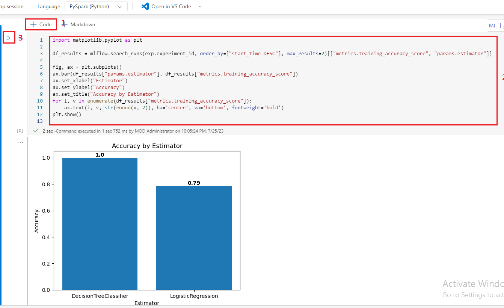
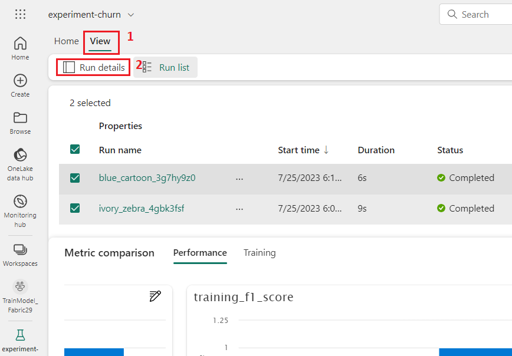

**Introduction**

In this lab, you’ll use Microsoft Fabric to create a notebook and train
a machine learning model to predict customer churn. You’ll use
Scikit-Learn to train the model and MLflow to track its performance.
Customer churn is a critical business problem that many companies face,
and predicting which customers are likely to churn can help companies
retain their customers and increase revenue. By completing this lab,
you’ll gain hands-on experience in machine learning and model tracking
and learn how to use Microsoft Fabric to create a notebook for your
projects.

**Objectives**

- To create Fabric workspace with trial enabled.

- To set up "TrainModel_Lakehouse" and upload data.

- To create a notebook for interactive coding.

- To load data into Pandas and Spark DataFrames.

- To train Logistic Regression and Decision Tree models, track with
  MLflow.

- To manage experiments using MLflow: list, retrieve, and order runs.

- To explore experiment results in Microsoft Fabric.

- To save best model as "model-churn" in Registered versions.

- To rename and save the notebook, end Spark session.

- To delete the created workspace in Microsoft Fabric.

## Task 1: Create a workspace

Before working with data in Fabric, create a workspace with the Fabric
trial enabled.

1.  Open your browser, navigate to the address bar, and type or paste
    the following URL: <https://app.fabric.microsoft.com/> then press
    the **Enter** button.

**Note**: If you’ve landed on the Microsoft **Fabric Home** page, then
skip steps from \#2 to \#4.

>  alt="A screenshot of a computer Description automatically generated" />

2.  In the **Microsoft Fabric** window, enter your credentials, and
    click on the **Submit** button.

>  alt="A close up of a white and green object Description automatically generated" />

3.  Then, In the **Microsoft** window enter the password and click on
    the **Sign in** button**.**

>  alt="A login screen with a red box and blue text Description automatically generated" />

4.  In **Stay signed in?** window, click on the **Yes** button.

>  alt="A screenshot of a computer error Description automatically generated" />

5.  In the **Microsoft Fabric** home page, select the **Power BI**
    template.

>  alt="A screenshot of a computer Description automatically generated" />

6.  In the **Power BI Home** page menu bar on the left,
    select **Workspaces** (the icon looks similar to 🗇).

>  alt="A screenshot of a computer Description automatically generated" />

7.  In the Workspaces pane Select **+** **New workspace**.

>  alt="A screenshot of a computer Description automatically generated" />

8.  In the **Create a workspace tab**, enter the following details and
    click on the **Apply** button.

| **Name** | ***TrainModel_FabricXX** (*XX can be a unique number) (here, we entered **TrainModel_Fabric29*)*** |
|----|----|
| **Advanced** | Under **License mode**, select **Trial** |
| **Default storage format** | **Small dataset storage format** |

>  style="width:4.80213in;height:5.65341in" />


9.  Wait for the deployment to complete. It takes 2-3 minutes to
    complete. When your new workspace opens, it should be empty.

## Task 2: Create a lakehouse and upload files

Now that you have a workspace, it’s time to switch to the *Data
science* experience in the portal and create a data lakehouse for the
data files you’re going to analyze.

1.  At the bottom left of the Power BI portal, select the **Power
    BI** icon and switch to the **Data Engineering** experience.

>  style="width:4.62083in;height:4.73932in" />

2.  In the **Synapse** **Data engineering** **Home** page, select
    **Lakehouse** under **New** pane.

> 

3.  In the **New lakehouse** dialog box, enter **TrainModel_Lakehouse**    in the **Name** field, click on the **Create** button.


4.  A new empty lakehouse will be created. You need to ingest some data
    into the **TrainModel_Lakehouse** for analysis.


5.  Wait for few minutes, you’ll will receive a notification stating -
    **Successfully created SQL endpoint**.

>  style="width:4.29204in;height:2.35854in" />

6.  In the **TrainModel_Lakehouse** page, under the **Explorer**
    section, click on **TrainModel_Lakehouse**, then click on the
    horizontal ellipsis besides **Files** as shown in the below image.
    Navigate and click on **Upload** and then select **Upload files**.

> 

7.  In the **Upload files** pane that appears on the right side, click
    on **Folder** icon under the **Files** and browse to **C:\LabFiles**
    on your VM, then select **churn.csv** file. Click on the **Open**
    button.


8.  Then, click on the **Upload** button.

>  style="width:4.40139in;height:3.03056in" />

9.  After the files have been uploaded, click on **Close.**

>  style="width:4.38611in;height:4.55278in" />

10. After the files have been uploaded, click on **Files** and verify
    that the CSV file have been uploaded.

>  style="width:6.49236in;height:2.32569in" />

## Task 3: Create a notebook

To train a model, you can create a *notebook*. Notebooks provide an
interactive environment in which you can write and run code (in multiple
languages) as *experiments*.

1.  At the bottom left of the TrainModel_Lakehouse page, select
    the **Data engineering** icon and switch to the **Data
    science** experience.

>  style="width:4.68332in;height:5.92917in" />

2.  In the **Synapse Data Science** **Home** page, select
    **Notebook**under current workspace of **TrainModel_FabricXX.**


3.  After a few seconds, a new notebook containing a single *cell* will
    open. Notebooks are made up of one or more cells that can
    contain **code** or **markdown** (formatted text).

>  style="width:7.01934in;height:4.36534in" />

4.  Select the first cell (which is currently a *code* cell), and then
    in the dynamic tool bar at its top-right, use the **M↓** button to
    convert the cell to a *markdown* cell.


When the cell changes to a markdown cell, the text it contains is
rendered.

5.  Use the **🖉 (Edit**) button to switch the cell to editing mode, then
    delete the content and enter the following text:

> ```CodeCopy
>
> \# Train a machine learning model and track with MLflow
>
> Use the code in this notebook to train and track models.


## Task 4: Load data into a dataframe

Now you’re ready to run code to prepare data and train a model. To work
with data, you’ll use *dataframes*. Dataframes in Spark are similar to
Pandas dataframes in Python, and provide a common structure for working
with data in rows and columns.

1.  In the **Lakehouse explorer** section, click on the **Add** button
    under the **Add lakehouse** to add a lakehouse.

>  style="width:5.91099in;height:4.58704in" />

2.  In **Add lakehouse** dialog box, select **Existing lakehouse** radio
    button and select **Add**.

>  style="width:3.48472in;height:2.18194in" />

3.  In **Choose the data you want to connect** page, select your
    lakehouse i.e., **TrainModel**\_**Lakehouse**, then click on the
    **Add** button.


4.  Select the **Files** folder, so that the **churn.csv** file is
    listed next to the notebook editor.

>  style="width:5.97708in;height:5.35625in" />

5.  Hover your mouse to **churn.csv** file. Click on the horizontal
    ellipsis (…) beside **churn.csv**, select **Load data** and select
    **Pandas**. A new code cell containing the following code will be
    added to the notebook:

>``` CodeCopy
>import pandas as pd
># Load data into pandas DataFrame from "/lakehouse/default/" + "Files/churn.csv"
>f = pd.read_csv("/lakehouse/default/" + "Files/churn.csv")
>display(df)


**Tip**: You can hide the pane containing the files on the left by using
its **«** icon. Doing so will help you focus on the notebook.

6.  Now, select the cell and delete it.


7.  Again, hover your mouse to **churn.csv** file. Click on the
    horizontal ellipsis (…) beside **churn.csv**, select **Load
    data** and then click on **Spark**. A new code cell containing the
    following code will be added to the notebook:

>```CodeCopy
>
>df = spark.read.format("csv").option("header","true").load("Files/churn.csv")
># df now is a Spark DataFrame containing CSV data from "Files/churn.csv".
>display(df)

>
>  style="width:6.49236in;height:3.53056in" />
>
>  alt="A screenshot of a computer Description automatically generated" />

8.  Use the **▷ Run cell** button on the left of the cell to execute it.


**Note**: Since this is the first time you’ve run any Spark code in this
session, the Spark pool must be started. This means that the first run
in the session can take a minute or so to complete. Subsequent runs will
be quicker.

9.  When the cell command has completed, review the output below the
    cell, which should look similar to this:


10. The output shows the rows and columns of customer data from the
    **churn.csv** file.

## Task 5: Train a machine learning model

Now that you’ve loaded the data, you can use it to train a machine
learning model and predict customer churn. You’ll train a model using
the Scikit-Learn library and track the model with MLflow.

1.  Hover your mouse below the output cell, you’ll see the **+
    Code** icon. Click on the **+ Code** icon and enter the following
    code in the cell:

> ```CodeCopy
> from sklearn.model_selection import train_test_split
>
>print("Splitting data...")
>X, y = 
>df[['years_with_company','total_day_calls','total_eve_calls','total_night_calls','total_intl_calls','average_call_minutes','total_customer_service_calls','age']].values, df['churn'].values
>   
>X_train, X_test, y_train, y_test = train_test_split(X, y, test_size=0.30, random_state=0)


2.  **Run** the code cell you added, and note you’re omitting
    ‘**CustomerID**’ from the dataset, and splitting the data into a
    training and test dataset.


3.  Click on **+ Code** and copy and paste the below code and then click
    on **Run cell** button.

> ```CodeCopy
>
> import mlflow
>experiment_name = "experiment-churn"
>mlflow.set_experiment(experiment_name)


4.  The code creates an MLflow experiment named **experiment-churn**.
    Your models will be tracked in this experiment.

>  style="width:7.11461in;height:2.38826in" />

5.  Add another new code cell to the notebook, enter the following code
    in it, and run it:

> ```CodeCopy
>
> from sklearn.linear_model import LogisticRegression
>   
>with mlflow.start_run():
>    mlflow.autolog()
>
>    model = LogisticRegression(C=1/0.1, solver="liblinear").fit(X_train, y_train)
>
>   mlflow.log_param("estimator", "LogisticRegression")


6.  The code trains a classification model using Logistic Regression.
    Parameters, metrics, and artifacts, are automatically logged with
    MLflow. Additionally, you’re logging a parameter
    called **estimator**, with the value **LogisticRegression**.


7.  Click on **+ Code** and copy and paste the below code and then click
    on **Run cell** button.

> ```CodeCopy
>
> from sklearn.tree import DecisionTreeClassifier
>   
>with mlflow.start_run():
>    mlflow.autolog()
>
 >   model = DecisionTreeClassifier().fit(X_train, y_train)
 >  
>    mlflow.log_param("estimator", "DecisionTreeClassifier")


8.  The code trains a classification model using Decision Tree
    Classifier. Parameters, metrics, and artifacts, are automatically
    logged with MLflow. Additionally, you’re logging a parameter
    called estimator, with the value DecisionTreeClassifier.


## Task 6: Use MLflow to search and view your experiments

When you’ve trained and tracked models with MLflow, you can use the
MLflow library to retrieve your experiments and its details.

1.  To list all experiments, Use the **+ Code** icon below the cell
    output to add the following code and use the **▷ Run cell** button
    on the left of the cell to run it.

> ```CodeCopy
>
> import mlflow
>experiments = mlflow.search_experiments()
>for exp in experiments:
>    print(exp.name)


2.  To retrieve a specific experiment, you can get it by its name use
    the **+ Code** icon below the cell output to add the following code
    and use the **▷ Run cell** button on the left of the cell to run it.

> ```CodeCopy
>
> experiment_name = "experiment-churn"
>exp = mlflow.get_experiment_by_name(experiment_name)
>print(exp)


3.  Using an experiment name, you can retrieve all jobs of that
    experiment use the **+ Code** icon below the cell output to add the
    following code and use the **▷ Run cell** button on the left of the
    cell to run it.

> ```CodeCopy
>
> mlflow.search_runs(exp.experiment_id)


4.  To more easily compare job runs and outputs, you can configure the
    search to order the results. For example, the following cell orders
    the results by **start_time**, and only shows a maximum
    of **2** results:

5.  Use the **+ Code** icon below the cell output to add the following
    code and use the **▷ Run cell** button on the left of the cell to
    run it.

> ```CodeCopy
>
>mlflow.search_runs(exp.experiment_id, order_by=["start_time DESC"], max_results=2)


6.  Finally, you can plot the evaluation metrics of multiple models next
    to each other to easily compare models. Use the **+ Code** icon
    below the cell output to add the following code and use the **▷ Run
    cell** button on the left of the cell to run it

> ```CodeCopy
>
> import matplotlib.pyplot as plt
>   
>df_results = mlflow.search_runs(exp.experiment_id, order_by=["start_time DESC"], max_results=2)[["metrics.training_accuracy_score", "params.estimator"]]
>   
>fig, ax = plt.subplots()
>ax.bar(df_results["params.estimator"], df_results["metrics.>training_accuracy_score"])
>ax.set_xlabel("Estimator")
>ax.set_ylabel("Accuracy")
>ax.set_title("Accuracy by Estimator")
>for i, v in enumerate(df_results["metrics.training_accuracy_score"]):
 >   ax.text(i, v, str(round(v, 2)), ha='center', va='bottom', fontweight='bold')
>plt.show()

>
> The output should resemble the following image:



## Task 7: Explore your experiments

Microsoft Fabric will keep track of all your experiments and allows you
to visually explore them.

1.  Select **TrainModel_FabricXX** in the left navigation pane.

>  style="width:4.26802in;height:6.16856in" />

2.  In the **TrainModel_FabricXX** pane, select
    the **experiment-churn** experiment to open it.


**Tip:** If you don’t see any logged experiment runs, refresh the page.

3.  In case, **Notebook,Experiments** **and Model** dialog box appears,
    then click on the **Skip for now** button.


4.  In the **experiment-churn** page, select the **View** tab.

>  style="width:5.66758in;height:3.40341in" />

5.  Select **Run list** under the **View**

>  style="width:5.69886in;height:4.0829in" />


6.  Select the two latest runs by checking each box. As a result, your
    two last runs will be compared to each other in the **Metric
    comparison** pane. By default, the metrics are plotted by run name.

>  style="width:6.9369in;height:3.94129in" />

7.  In the **Metric comparison** pane, for the graph visualizing the
    accuracy for each run select the **🖉** (Edit) button of
    **training_accuracy_score**.

8.  Enter the following details of the **Personalize** settings.

- Change the **visualization type** to **bar**.

- Change the **X-axis** to **estimate**

- Select **Replace** and explore the new graph.


9.  In the **Metric comparison** pane, for the graph visualizing the
    accuracy for each run select the **🖉** (Edit) button of
    **training_f1_score.**.

10. Enter the following details of the **Personalize** settings.

- Change the **visualization type** to **bar**.

- Change the **X-axis** to **estimate**

- Select **Replace** and explore the new graph.


11. In the **Metric comparison** pane, for the graph visualizing the
    accuracy for each run select the **🖉** (Edit) button of
    **training_log_loss.**.

12. Enter the following details of the **Personalize** settings.

- Change the **visualization type** to **bar**.

- Change the **X-axis** to **estimate**

- Select **Replace** and explore the new graph.


By plotting the accuracy per logged estimator, you can review which
algorithm resulted in a better model.

## Task 8: Save the model

After comparing machine learning models that you’ve trained across
experiment runs, you can choose the best performing model. To use the
best performing model, save the model and use it to generate
predictions.

1.  In the experiment-churn page, select the **View** tab and
    select **Run details**.

>  style="width:6.49236in;height:4.52292in" />

2.  Select the run with the highest accuracy. Select **Save** in
    the **Save as model** box.


3.  In the Save as model pop-up window, select **Create a new model** as
    Select methods. Enter the **Model name** as **model-churn**, and
    select **Save.**

>  style="width:3.17431in;height:3.18194in" />

7.  Select **View model** in the notification that appears at the top
    right of your screen when the model is created. You can also refresh
    the window. The saved model is linked under **Registered version**

>  style="width:3.8607in;height:2.01705in" />
>
>  alt="A screenshot of a computer Description automatically generated" />

8.  Note that the model, the experiment, and the experiment run are
    linked, allowing you to review how the model is trained.

## Task 9: Save the notebook and end the Spark session

Now that you’ve finished training and evaluating the models, you can
save the notebook with a meaningful name and end the Spark session.

1.  Select **TrainModel_FabricXX** in the left navigation pane.


2.  In the **TrainModel_FabricXX** pane, select the **Notebook** to open
    it.

> 

3.  In the notebook menu bar, use the ⚙️ **Settings** icon to view the
    notebook settings.


4.  Set the **Name** of the notebook to **Train and compare models**,
    and then **close** the settings pane.


5.  On the notebook menu, select **Stop session** to end the Spark
    session.


## Task 10: Clean up resources

In this exercise, you have created a notebook and trained a machine
learning model. You used Scikit-Learn to train the model and MLflow to
track it´s performance.

If you’ve finished exploring your model and experiments, you can delete
the workspace you created for this exercise.

1.  In the bar on the left, select the icon for your workspace i.e
    **TrainModel_FabricXX** to view all of the items it contains.

>  style="width:4.21016in;height:3.94975in" />

2.  In the menu on the toolbar, select **Workspace settings**.

>  style="width:6.49236in;height:3.56806in" />

3.  In the **Workspace settings** tab, select **Other** section and
    select **Remove this workspace** .

>  style="width:6.49236in;height:3.36389in" />

9.  In the **Delete workspace?** dialog box, click on the **Delete**
    button.

>  style="width:5.11389in;height:1.77292in" />

**Summary**

You’ve created a workspace in Microsoft Fabric with a trial enabled.
Then, you’ve proceeded to set up a data lakehouse, ingested data for
analysis, and created a notebook for interactive coding. You’ve loaded
data into both Pandas and Spark DataFrames, and subsequently trained
machine learning models using Scikit-Learn while tracking their
performance with MLflow. You’ve effectively managed experiments using
MLflow, listing, retrieving, and ordering runs. Additionally, you’ve
explored experiment results in Microsoft Fabric, visualizing and
comparing model accuracy. The best performing model was saved for future
use, and the notebook was appropriately named and saved. Finally, you’ve
completed the lab by cleaning up resources and deleting the workspace
created for the exercise.
