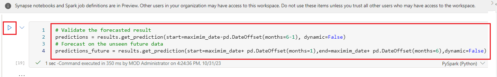
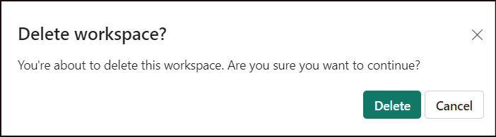
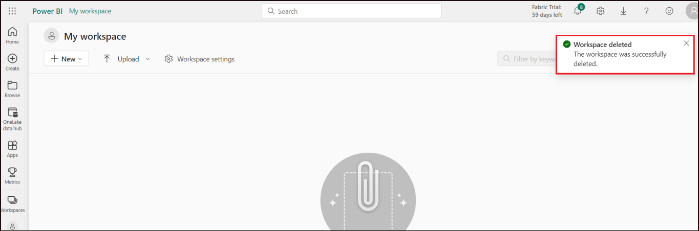

# Lab 08-Develop, evaluate, and score a forecasting model for superstore sales
**Introduction**

In this lab, you'll see Microsoft Fabric's end-to-end data science
workflow for a forecasting model. This scenario uses the historic sales
data to predict the sales for different categories of products at a
superstore.

Forecasting is a crucial asset in sales, harnessing historical data and
predictive methods to provide insights into future trends. By analyzing
past sales, identifying patterns, and learning from consumer behavior,
businesses can optimize inventory, production, and marketing strategies.
This proactive approach enhances adaptability, responsiveness, and
overall performance of businesses in a dynamic marketplace.

**Objective**

1.  Load the data

2.  Understand and process the data using exploratory data analysis

3.  Train a machine learning model using an open source software package
    called SARIMAX and track experiments using MLflow and Fabric
    Autologging feature

4.  Save the final machine learning model and make predictions

5.  Demonstrate the model performance via visualizations in Power BI

## **Task 1: Load the Data**

**Dataset**

The dataset contains the churn status of 9995 instances of sales of
different products, along with 21 attributes that include: Row ID, Order
ID, Order Date, Ship Date, Ship Mode, Customer ID, Customer
Name, Segment, Country, City, State, Postal Code, Region, Product
ID, Category, Sub-Category, Product
Name, Sales, Quantity, Discount, Profit.

1.  Open your browser, navigate to the address bar, and type or paste
    the following URL: <https://app.fabric.microsoft.com/home> then
    press the **Enter** button

2.  In the **Microsoft Azure** window, enter your **Sign-in**
    credentials, and click on the **Next** button.

>  alt="A screenshot of a computer Description automatically generated" />

3.  Then, In the **Microsoft** window enter the password and click on
    the **Sign in** button**.**

>  alt="A login screen with a red box and blue text Description automatically generated" />

4.  In **Stay signed in?** window, click on the **Yes** button.

>  alt="A screenshot of a computer error Description automatically generated" />

5.  In the **Power BI** **Home** page, on the left-side pane navigate
    and click on **Workspaces**.


6.  In the Workspaces pane Select **Data-ScienceXX** workspace.


7.  In the **Data-ScienceXX** workspace page, click on the drop-down
    arrow in the **+New** button, then select **Import notebook.**


8.  On the **Import status pane that appears on the right side, click on
    Upload button** and then browse to **C:\Labfiles\data-science** and
    then select **AIsample - Superstore Forecast** notebook and click on
    the **Open** button.


9.  Once the notebooks are imported, select **Go to workspace** in the
    import dialog box


10. On the Data-ScienceXX workspace homepage, select the
    **FabricData_Sciencelakehouse** lakehouse.


11. In the Fabric**Data_Sciencelakehouse** page, select **Open
    notebook** \> **Existing notebook** from the top navigation menu.


12. From the list of **Open existing notebook**, select the **AIsample -
    Superstore Forecast** notebook and select **Open**.


13. If the imported notebook includes output, select the **Edit** menu,
    then select **Clear all outputs**.


14. To load the data, select the code cell and click on the **play**
    button to execute cell.


15. Download a publicly available version of the dataset and then store
    it in a Fabric lakehouse. Select the code cell and click on the
    **play** button to execute cell.


16. Start recording the time it takes to run this notebook. Select the
    code cell and click on the **play** button to execute cell.


17. Autologging in Microsoft Fabric extends the MLflow autologging
    capabilities by automatically capturing the values of input
    parameters and output metrics of a machine learning model as it is
    being trained. This information is then logged to the workspace,
    where it can be accessed and visualized using the MLflow APIs or the
    corresponding experiment in the workspace.

18. Select the code cell and click on the **play** button to execute
    cell.


19. Read raw data from the **Files** section of the lakehouse. Add
    additional columns for different date parts and the same information
    will be used to create partitioned delta table. Since the raw date
    is stored as an Excel file, you need to use Pandas to read the raw
    data.

20. Select the code cell and click on the **play** button to execute
    cell.


## **Task 2: Exploratory Data Analysis**

1.  To import the required libraries. Select the code cell and click on
    the **play** button to execute cell.


2.  To review the dataset, it is recommended to manually go through a
    subset of the data to gain a better understanding. In this regard,
    you could use the display function to print the DataFrame. You can
    also show the "Chart" views to easily visualize subsets of the
    dataset.

3.  Select the code cell and click on the **play** button to execute
    cell.


4.  The primary focus will be on forecasting the sales for
    the Furniture category. This choice is made to speed up the
    computation and facilitate the demonstration of the model's
    performance. However, it is important to realize that this
    techniques used in this notebook are adaptable and can be extended
    to predict the sales of various other product categories.

5.  Select the code cell and click on the **play** button to execute
    cell.


6.  To Pre-processing the data, select the code cell and click on the
    **play** button to execute cell.


7.  The dataset is structured on a daily basis, and since the goal is to
    develop a model to forecast the sales on a monthly basis, you need
    to resample on the column Order Date.

8.  First, group the Furniture category by Order Date and then calculate
    the sum of the Sales column for each group in order to determine the
    total sales for each unique Order Date. Then, resample
    the Sales column using the MS frequency to aggregate the data by
    month and then you calculate the mean sales value for each month.

9.  Select the code cell and click on the **play** button to execute
    cell.


10. Demonstrate the impact of Order Date on the Sales for the Furniture
    category. Select the code cell and click on the **play** button to
    execute cell.


11. Prior to any statistical analysis, you need to
    import statsmodels. Statsmodels is a Python module that provides
    classes and functions for the estimation of many different
    statistical models, as well as for conducting statistical tests and
    statistical data exploration.

12. Select the code cell and click on the **play** button to execute
    cell.


13. A time series tracks four data elements at set intervals in order to
    determine the variation of those four elements in the time series
    pattern. These elements include:

- **Level:** Refers to the fundamental component that represents the
  average value for a specific time period.

- **Trend:** Describes whether the time series is decreasing, constant,
  or increasing over time.

- **Seasonality:** Describes the periodic signal in the time series and
  looks for cyclic occurrences that affect the time series' increasing
  or decreasing patterns.

- **Noise/Residual:** Refers to the random fluctuations and variability
  in the time series data that cannot be explained by the model.

14. Select the code cell and click on the **play** button to execute
    cell.


## Task 3: Model Training and Tracking

With your data in place, you can define the forecasting model. Apply the
Seasonal AutoRegressive Integrated Moving Average with eXogenous
regressors (SARIMAX) in this notebook. SARIMAX is a time series
forecasting model that extends SARIMA to include exogenous variables. It
combines autoregressive (AR) and moving average (MA) components,
seasonal differencing, and external predictors to make accurate and
flexible forecasts for time series data, making it a powerful tool for
various forecasting tasks.

1.  Use MLfLow and Fabric Autologging to track the experiments. Here
    you'll load the delta table from the lakehouse. You may use other
    delta tables considering the lakehouse as the source. Select the
    code cell and click on the **play** button to execute cell.


2.  SARIMAX takes into account the parameters involved in regular ARIMA
    mode (p,d,q) and also adds the seasonality parameters (P,D,Q,s).
    These arguments to SARIMAX model are called order (p,d,q) and
    seasonal order (P,D,Q,s) respectively and hence 7 parameters to
    tune. Prior to model training, you need to set up these parameters
    which are defined in the following.

3.  Select the code cell and click on the **play** button to execute
    cell.


4.  To model training, select the code cell and click on the **play**
    button to execute cell.


5.  Visualize a time series forecast for furniture sales data, showing
    both the observed data and the one-step-ahead forecast with a
    confidence interval shaded region. Select the code cell and click on
    the **play** button to execute cell.




6.  Note that predictions is utilized to assess the model's performance
    by contrasting it with the actual values,
    whereas **predictions_future** is indicative of future forecasting.

7.  Select the code cell and click on the **play** button to execute
    cell.


## Task 4: Score the model and save predictions

1.  The actual values are integrated with the forecasted values, which
    will be employed to create the Power BI report. Note that these
    results will be stored into a table within the lakehouse.

2.  Select the code cell and click on the **play** button to execute
    cell.


## **Step 5: Business Intelligence via Visualizations in Power BI**

The Power BI report shows the mean absolute percentage error (MAPE) of
16.58. MAPE is a metric that defines the accuracy of a forecasting
method and represents how accurate the forecasted quantities are in
comparison with the actual quantities. MAPE is a straightforward metric,
with a 10% MAPE representing that the average deviation between the
forecasted values and actual values was 10%, regardless of whether the
deviation was positive or negative. Note that what one considers to be a
desirable MAPE value varies across different industries.

The light blue line in the graph represents the actual sales values,
while the dark blue line represents the forecasted sales values. An
analysis of the comparison between the actual and forecasted sales
reveals that the model effectively predicts sales for the Furniture
category during the first six months of 2023.

Based on this observation, it is justifiable to have confidence in the
model's forecasting capabilities for the overall sales in the last six
months of 2023 and extending into 2024. This confidence can inform
strategic decisions regarding inventory management, raw material
procurement, and other business-related considerations.

1.  Now, click on **FabricData_Sciencelakehouse** on the left-sided
    navigation pane


2.  Select **New semantic model** on the top ribbon.


3.  In the **New dataset** box, enter the dataset a name, such as **bank
    churn predictions**.Then select
    the **customer_churn_test_predictions** dataset and
    select **Confirm**.

>  style="width:4.48333in;height:5.49167in" />
>
> 

4.  Add a new measure for the MAPE.

<!-- -->

1)  Select **New measure** in the top ribbon. This action adds a new
    item named **Measure** to the **Demand_Forecast_New_1** dataset, and
    opens a formula bar above the table.

> 

2)  To determine the average the MAPE , replace Measure = in the formula
    bar with:

> ```PythonCopy
>
> MAPE_Value = AVERAGE(Demand_Forecast_New_1[MAPE])

3)  To apply the formula, select the **check mark** in the formula bar.
    The new measure appears in the data table. The calculator icon shows
    it was created as a measure.


5.  Add a new measure that average the total number of forecasted sales
    . You'll need it for the rest of the new measures.

<!-- -->

1)  Select **New measure** in the top ribbon to add a new item
    named **Measure** to the **Demand_Forecast_New_1**  dataset. This
    action also opens a formula bar above the table.

> ```PythonCopy
>
> Forecasted_Value = AVERAGE(Demand_Forecast_New_1[Forecasted_Sales])

2)  Select the **check mark** in the formula bar to apply the formula.

> 

6.  Add a new measure that counts the total number of actual sales .
    You'll need it for the rest of the new measures.

<!-- -->

3)  Select **New measure** in the top ribbon to add a new item
    named **Measure** to the **Demand_Forecast_New_1**  dataset. This
    action also opens a formula bar above the table.

> ```PythonCopy
>
> Actual_Value = AVERAGE(Demand_Forecast_New_1[Actual_Sales])

4)  Select the **check mark** in the formula bar to apply the formula.


7.  On the tools at the top of the dataset page, select **New report**
    to open the Power BI report authoring page.


8.  In the Ribbon, select **Text box**. Type in **ML-Forecast** .
    **Highlight** the **text** Change the font size and background color
    in the Format panel. Adjust the font size and color by selecting the
    text and using the format bar.


9.  In the Visualizations panel, select the **Card** icon. From
    the **Data** pane, select **MAPE_Value**. Change the font size and
    background color in the Format panel. Drag this visualization to the
    top right of the report.


10. In the Visualizations panel, select the **Slicer** icon. From
    the **Data** pane, select **Category**.

11. Change the slicer settings, click on **Format your visual**, under
    the **Visual** drop down the **Slicer settings** and select the
    **style** as **Dropdown** font size. Change the background color in
    the Format panel. Drag this visualization to the top right of the
    report.


12. In the Visualizations panel, select the **Line chart** icon.
    Select **Date** for the x-axis, **Actual_Value** for column y-axis,
    and **Forecasted_value** for the line y-axis.


13. From the ribbon, select **File** \> **Save**


14. Enter the name of your report as **ML-Forecast**. Select **Save**.


## **Task 6: Clean up resources**

1.  Select your workspace, the **Data-ScienceXX** from the left-hand
    navigation menu. It opens the workspace item view.


2.  Select the ***...*** option under the workspace name and
    select **Workspace settings**.


3.  Select **Other** and **Remove this workspace.**


4.  Click on **Delete** in the warning that pops up.



5.  Wait for a notification that the Workspace has been deleted, before
    proceeding to the next lab.


