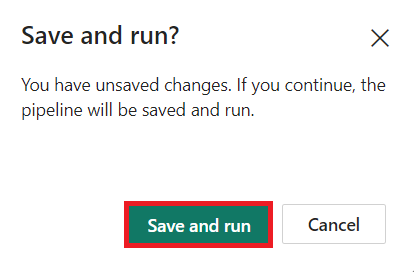
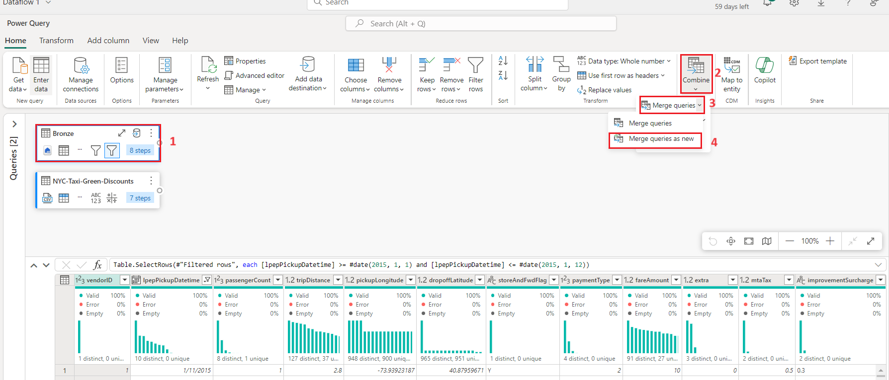
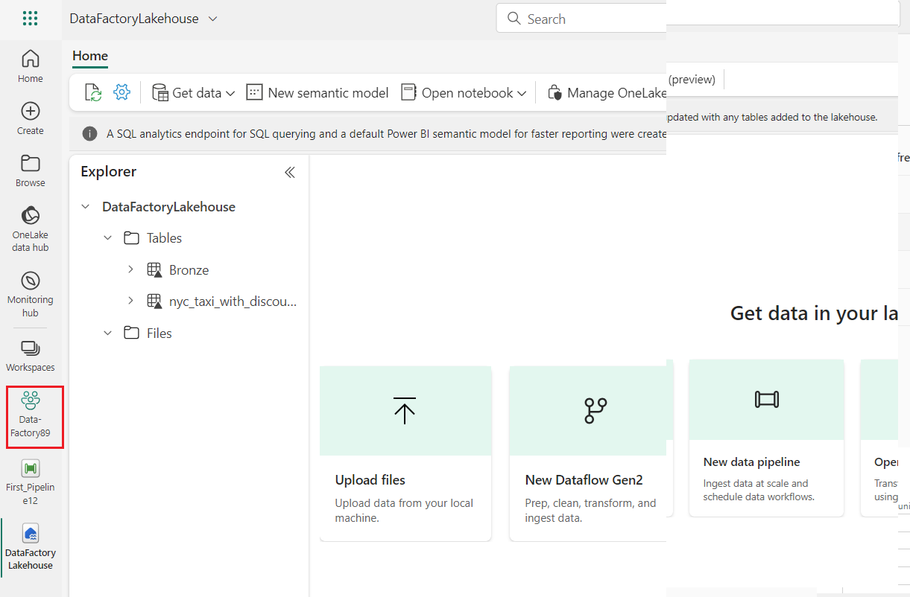
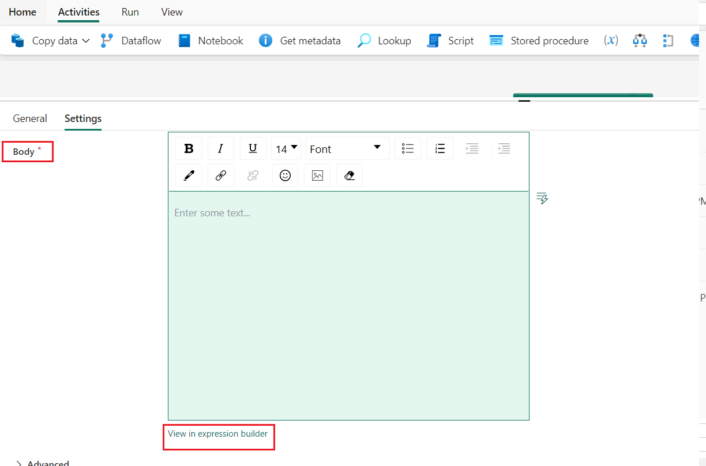
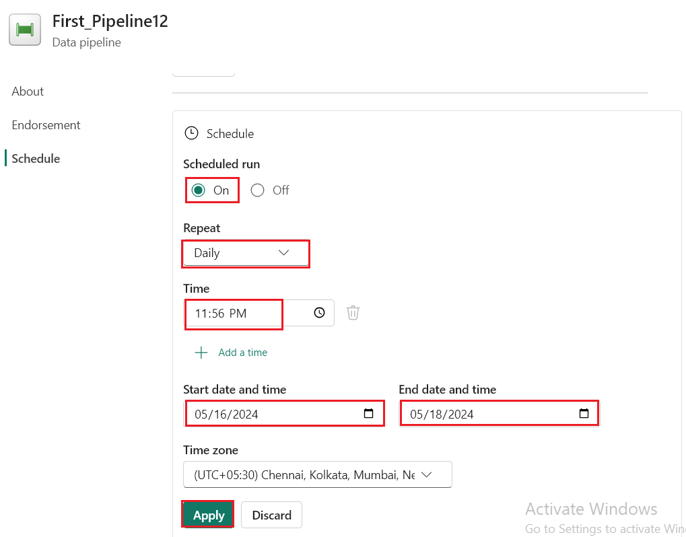

Lab-A Data Factory solution for moving and transforming data with
dataflows and data pipelines (Optional)

**Introduction**

This lab helps you accelerate the evaluation process for Data Factory in
Microsoft Fabric by providing a step-by-step guidance for a full data
integration scenario within one hour. By the end of this tutorial, you
understand the value and key capabilities of Data Factory and know how
to complete a common end-to-end data integration scenario.

**Objective**

The lab is divided into three modules:

- Exercise 1: Create a pipeline with Data Factory to ingest raw data
  from a Blob storage to a Bronze table in a data Lakehouse.

- Exercise 2: Transform data with a dataflow in Data Factory to process
  the raw data from your Bronze table and move it to a Gold table in the
  data Lakehouse.

- Exercise 3: Automate and send notifications with Data Factory to send
  an email to notify you once all the jobs are complete, and finally,
  setup the entire flow to run on a scheduled basis.

# Exercise 1: Create a pipeline with Data Factory

** Important**

Microsoft Fabric is currently in PREVIEW. This information relates to a
prerelease product that may be substantially modified before it's
released. Microsoft makes no warranties, expressed or implied, with
respect to the information provided here. Refer to [**<u>Azure Data
Factory
documentation</u>**](https://learn.microsoft.com/en-us/azure/data-factory/) for
the service in Azure.

## Task 1: Create a workspace

Before working with data in Fabric, create a workspace with the Fabric
trial enabled.

1.  Open your browser, navigate to the address bar, and type or paste
    the following URL: <https://app.fabric.microsoft.com/> then press
    the **Enter** button.

>  alt="A screenshot of a computer Description automatically generated" />
>
> **Note**: If you are directed to Microsoft Fabric Home page, then skip
> steps from \#2 to \#4.

2.  In the **Microsoft Fabric** window, enter your credentials, and
    click on the **Submit** button.

>  alt="A close up of a white and green object Description automatically generated" />

3.  Then, in the **Microsoft** window, enter the password and click on
    the **Sign in** button**.**

>  alt="A login screen with a red box and blue text Description automatically generated" />

4.  In **Stay signed in?** window, click on the **Yes** button.

>  alt="A screenshot of a computer error Description automatically generated" />

5.  In the **Microsoft Fabric** home page, select the **Power BI**
    template.

>  alt="A screenshot of a computer Description automatically generated" />

6.  In the **Power BI Home** page left-sided navigation bar,
    select **Workspaces** (the icon looks similar to 🗇).

>  alt="A screenshot of a computer Description automatically generated" />

7.  In the Workspaces pane, select **+** **New workspace**.

>  alt="A screenshot of a computer Description automatically generated" />

8.  In the **Create a workspace** tab, enter the following details and
    click on the **Apply** button.

| **Name** | ***D**ata-FactoryXX (*XX can be a unique number) (here, we entered ***Dataflow \_Fabric29)*** |
|----|----|
| **Advanced** | Under **License mode**, select **Trial** |
| **Default storage format** | **Small dataset storage format** |

>  style="width:5.02821in;height:6.52917in" />

9.  Wait for the deployment to complete. It’ll take approximately 2-3
    minutes.

10. In the **Data-FactoryXX** workspace page, navigate and click on
    **+New** button, then select **Lakehouse.**

11. In the **New lakehouse** dialog box, enter **DataFactoryLakehouse**
    in the **Name** field, click on the **Create** button and open the
    new lakehouse.

12. Now, click on **Data-FactoryXX** on the left-sided navigation pane.

##  Task 2: Create a data pipeline

1.  Select the default Power BI icon at the bottom left of the screen,
    and switch to the **Data Factory** experience.

>  style="width:5.64583in;height:5.94298in" />

2.  In the **Data Factory** Home page, click on **Data pipeline** as
    shown in the below image.

3.  In the **New pipeline** dialog box, enter **First_Pipeline1** in
    the **Name** field, then click on the **Create** button.

>  style="width:3.11667in;height:2.53333in" />

## Task 3: Use a Copy activity in the pipeline to load sample data to a data Lakehouse

1.  In the **First_Pipeline1** home page Select **Copy data assistant**
     to open the copy assistant tool.

> 

2.  The **Copy data** dialog is displayed with the first step, **Choose
    data source**, highlighted. Scroll down if necessary to
    the **Sample** section, and select the **NYC Taxi-Green** data
    source type. Then select **Next**.

3.  In the **Connect to data source**, click on  **Next** button.

4.  For the **Choose data destination** step of the copy assistant,
    select **Lakehouse** and then **Next**.

5.  Select **Existing Lakehouse** on the data destination configuration
    page that appears, and select **DataFactoryLakehouse**. Then
    select **Next** again.

>  alt="A screenshot of a computer Description automatically generated" />

6.  Now configure the details of your Lakehouse destination on
    the **Select and map to folder path or table.** page.
    Select **Tables** for the **Root folder**, provide a table name
    **Bronze**, and select the **Next**.

>  alt="A screenshot of a computer Description automatically generated" />

7.  Finally, on the **Review + save** page of the copy data assistant,
    review the configuration. For this lab, uncheck the **Start data
    transfer immediately** checkbox, since we run the activity manually
    in the next step. Then select **OK**.

## **Task 4: Run and view the results of your Copy activity**.

1.  On the **Home** tab of the pipeline editor window, then select
    the **Run** button.

2.  In the **Save and run?** dialog box, click on **Save and run**
    button to execute these activities.

> 

3.  You can monitor the run and check the results on the **Output** tab
    below the pipeline canvas. Select the **activity name** as
    **Copy_ihy** to view the run details.

4.  The run details show 76,513,115 rows read and written.

5.  Expand the **Duration breakdown** section to see the duration of
    each stage of the Copy activity. After reviewing the copy details,
    select **Close**.

**Exercise 2: Transform data with a dataflow in Data Factory**

## Task 1: Get data from a Lakehouse table

1.  On the **First_Pipeline 1** page, from the sidebar
    select **Create.**

2.  On the **Data Factory Data-FactoryXX** home page, to create a new
    dataflow gen2 click on **Dataflow Gen2** under the **Data
    Factory.** 

3.  From the new dataflow menu, under the **Power Query** pane click on
    **Get data**, then select **More...**.

>  style="width:6.49167in;height:5.23333in" />

4.  In the **Choose data source** tab, search box search type
    **Lakehouse** and then click on the **Lakehouse** connector.

> 

5.  The **Connect to data source** dialog appears, select **Edit
    connection.** 

6.  In the **Connect to data source** dialog box, select **sign in**
    using your Power BI organizational account to set the identity that
    the dataflow uses to access the lakehouse.

7.  In **Connect to data source** dialog box, select **Next.**

>  style="width:6.91751in;height:3.04583in" />

8.  The **Choose data** dialog is displayed. Use the navigation pane to
    find the Lakehouse you created for the destination in the prior
    module, and select the **DataFactoryLakehouse** data table then
    click on **Create** button.

9.  Once your canvas is populated with the data, you can set **column
    profile** information, as this is useful for data profiling. You can
    apply the right transformation and target the right data values
    based on it.

10. To do this, select **Options** from the ribbon pane, then select the
    first three options under **Column profile**, and then
    select **OK**.

## Task 2: Transform the data imported from the Lakehouse

1.  Select the data type icon in the column header of the second
    column, **IpepPickupDatetime**, to display **right click** on the
    menu and select the **Change type** from the menu to convert the
    column from the **Date/Time** to **Date** type. 

2.  On the **Home** tab of the ribbon, select the **Choose
    columns** option from the **Manage columns** group.

3.  On the **Choose columns** dialog, **deselect** some columns listed
    here, then select **OK**.

    - lpepDropoffDatetime

    <!-- -->

    - puLocationId

    <!-- -->

    - doLocationId

    <!-- -->

    - pickupLatitude

    <!-- -->

    - dropoffLongitude

    <!-- -->

    - rateCodeID

>  style="width:4.26912in;height:5.4875in" />

4.  Select the **storeAndFwdFlag** column's filter and sort dropdown
    menu. (If you see a warning **List may be incomplete**,
    select **Load more** to see all the data.)

5.  Select '**Y'** to show only rows where a discount was applied, and
    then select **OK**.

6.  Select the **Ipep_Pickup_Datetime** column sort and filter dropdown
    menu, then select **Date filters**, and choose
    the **Between...** filter provided for Date and Date/Time types.

11. In the **Filter rows** dialog, select dates between **January 1,
    2015**, and **January 31, 2015**, then select **OK**.

> 

## Task 3: Connect to a CSV file containing discount data

Now, with the data from the trips in place, we want to load the data
that contains the respective discounts for each day and VendorID, and
prepare the data before combining it with the trips data.

1.  From the **Home** tab in the dataflow editor menu, select the **Get
    data** option, and then choose **Text/CSV**.

2.  In the **Connect to data source** pane, under **Connection
    settings**, select **Upload file (Preview)** radio button, then
    click on **Browse** button and browse your VM **C:\LabFiles**, then
    select the **NYC-Taxi-Green-Discounts** file and click on the
    **Open** button.

3.  In the **Connect to data source** pane, click on the **Next**
    button.

4.  On the **Preview file data** dialog, select **Create**.

## Task 4: Transform the discount data

1.  Reviewing the data, we see the headers appear to be in the first
    row. Promote them to headers by selecting the table's context menu
    at the top left of the preview grid area to select **Use first row
    as headers**.

*** Note:** After promoting the headers, you can see a new step added to
the **Applied steps** pane at the top of the dataflow editor to the data
types of your columns.*

2.  Right-click the **VendorID** column, and from the context menu
    displayed, select the option **Unpivot other columns**. This allows
    you to transform columns into attribute-value pairs, where columns
    become rows.

3.  With the table unpivoted, rename
    the **Attribute** and **Value** columns by double-clicking them and
    changing **Attribute** to **Date** and **Value** to **Discount**.

4.  Change the data type of the Date column by selecting the data type
    menu to the left of the column name and choosing **Date**.

5.  Select the **Discount** column and then select the **Transform** tab
    on the menu. Select **Number column**, and then
    select **Standard** numeric transformations from the submenu, and
    choose **Divide**.

6.  On the **Divide** dialog, enter the value 100, then click on **OK**
    button.

**Task 5: Combine trips and discounts data**

The next step is to combine both tables into a single table that has the
discount that should be applied to the trip, and the adjusted total.

1.  First, toggle the **Diagram view** button so you can see both of
    your queries.

2.  Select the **Bronze** query, and on the **Home** tab, Select
    the **Combine** menu and choose **Merge queries**, then **Merge
    queries as new**.

3.  On the **Merge** dialog,
    select **Generated-NYC-Taxi-Green-Discounts** from the **Right table
    for merge** drop down, and then select the "**light bulb**" icon on
    the top right of the dialog to see the suggested mapping of columns
    between the three tables.

4.  Choose each of the two suggested column mappings, one at a time,
    mapping the VendorID and date columns from both tables. When both
    mappings are added, the matched column headers are highlighted in
    each table.

5.  A message is shown asking you to allow combining data from multiple
    data sources to view the results. Select **OK** 

6.  In the table area, you'll initially see a warning that "The
    evaluation was canceled because combining data from multiple sources
    may reveal data from one source to another. Select continue if the
    possibility of revealing data is okay." Select **Continue** to
    display the combined data.

7.  In Privacy Levels dialog box, select the **check box :Ignore Privacy
    Lavels checks for this document. Ignoring privacy Levels could
    expose sensitive or confidential data to an unauthorized person**
    and click on the **Save** button.

8.  Notice how a new query was created in Diagram view showing the
    relationship of the new Merge query with the two queries you
    previously created. Looking at the table pane of the editor, scroll
    to the right of the Merge query column list to see a new column with
    table values is present. This is the "Generated NYC
    Taxi-Green-Discounts" column, and its type is **\[Table\]**. In the
    column header there's an icon with two arrows going in opposite
    directions, allowing you to select columns from the table. Deselect
    all of the columns except **Discount**, and then select **OK**.

9.  With the discount value now at the row level, we can create a new
    column to calculate the total amount after discount. To do so,
    select the **Add column** tab at the top of the editor, and
    choose **Custom column** from the **General** group.

10. On the **Custom column** dialog, you can use the [Power Query
    formula language (also known as
    M)](https://learn.microsoft.com/en-us/powerquery-m) to define how
    your new column should be calculated.
    Enter **TotalAfterDiscount** for the **New column name**,
    select **Currency** for the **Data type**, and provide the following
    M expression for the **Custom column formula**:

> *if \[totalAmount\] \> 0 then \[totalAmount\] \* (
> 1 -\[Discount\] ) else \[totalAmount\]*
>
> Then select **OK**.

11. Select the newly create **TotalAfterDiscount** column and then
    select the **Transform** tab at the top of the editor window. On
    the **Number column** group, select the **Rounding** drop down and
    then choose **Round...**.

12. On the **Round** dialog, enter **2** for the number of decimal
    places and then select **OK**.

> 

13. Change the data type of the **IpepPickupDatetime** from **Date** to
    **Date/Time**.

14. Finally, expand the **Query settings** pane from the right side of
    the editor if it isn't already expanded, and rename the query
    from **Merge** to **Output**.

**Task 6: Load the output query to a table in the Lakehouse**

With the output query now fully prepared and with data ready to output,
we can define the output destination for the query.

1.  Select the **Output** merge query created previously. Then select
    the **Home** tab in the editor, and **Add data destination** from
    the **Query** grouping, to select a **Lakehouse** destination.

2.  On the **Connect to data destination** dialog, your connection
    should already be selected. Select **Next** to continue.

3.  On the **Choose destination target** dialog, browse to the Lakehouse
    where you wish to load the data and name the new
    table **nyc_taxi_with_discounts**, then select **Next** again.

4.  On the **Choose destination settings** dialog, leave the
    default **Replace** update method, double check that your columns
    are mapped correctly, and select **Save settings**.

5.  Back in the main editor window, confirm that you see your output
    destination on the **Query settings** pane for the **Output** table,
    and then select **Publish**.

6.  On the workspace page, you can rename your dataflow by selecting the
    ellipsis to the right of the dataflow name that appears after you
    select the row, and choosing **Properties**.

7.  In the **Dataflow 1** dialog box,
    enter **nyc_taxi_data_with_discounts** in the name box, then
    select **Save**.

> 

8.  Select the refresh icon for the dataflow after selecting its row,
    and when complete, you should see your new Lakehouse table created
    as configured in the **Data destination** settings.

9.  In the **Data_FactoryXX** pane, select **DataFactoryLakehouse** to
    view the new table loaded there.

# Exercise 3: Automate and send notifications with Data Factory

** Important**

Microsoft Fabric is currently in PREVIEW. This information relates to a
prerelease product that may be substantially modified before it's
released. Microsoft makes no warranties, expressed or implied, with
respect to the information provided here. Refer to [**<u>Azure Data
Factory
documentation</u>**](https://learn.microsoft.com/en-us/azure/data-factory/) for
the service in Azure.

## Task 1: Add an Office 365 Outlook activity to your pipeline

1.  From **Tutorial_Lakehouse** page, navigate and click on
    **Data_FactoryXX** Workspace on the left-sided navigation menu.

2.  In the **Data_FactoryXX** view, select the **First_Pipeline1**.

3.  Select the **Activities** tab in the pipeline editor and find the
    **Office Outlook** activity.

4.  Select and drag the **On success** path (a green checkbox on the top
    right side of the activity in the pipeline canvas) from your **Copy
    activity** to your new **Office 365 Outlook** activity.

5.  Select the Office 365 Outlook activity from the pipeline canvas,
    then select the **Settings** tab of the property area below the
    canvas to configure the email. Click on **Sing in** button.

6.  Select your Power BI organizational account and then select **Allow
    access** to confirm.

**Note:** The service doesn't currently support personal email. You must
use an enterprise email address.

7.  Select the Office 365 Outlook activity from the pipeline canvas, on
    the **Settings** tab of the property area below the canvas to
    configure the email.

    - Enter your email address in the **To** section. If you want to use
      several addresses, use **;** to separate them.

    <!-- -->

    - For the **Subject**, select the field so that the **Add dynamic
      content** option appears, and then select it to display the
      pipeline expression builder canvas.

8.  The **Pipeline expression builder** dialog appears. Enter the
    following expression, then select **OK**:

> *@concat('DI in an Hour Pipeline Succeeded with
> Pipeline Run Id', pipeline().RunId)*

9.  For the **Body**, select the field again and choose the **View in
    expression builder** option when it appears below the text area. Add
    the following expression again in the **Pipeline expression
    builder** dialog that appears, then select **OK**:

> *@concat('RunID = ', pipeline().RunId, ' ; ',
> 'Copied rows ', activity('Copy data1').output.rowsCopied, ' ;
> ','Throughput ', activity('Copy data1').output.throughput)*

** Note:** Replace **Copy data1** with the name of your own pipeline
copy activity.

10. Finally select the **Home** tab at the top of the pipeline editor,
    and choose **Run**. Then select **Save and run** again on the
    confirmation dialog to execute these activities.

>  style="width:6.95947in;height:4.02917in" />
>
>  style="width:3.78333in;height:2.51667in" />
>
> 

11. After the pipeline runs successfully, check your email to find the
    confirmation email sent from the pipeline.

**Task 2: Schedule pipeline execution**

Once you finish developing and testing your pipeline, you can schedule
it to execute automatically.

1.  On the **Home** tab of the pipeline editor window,
    select **Schedule**.

2.  Configure the schedule as required. The example here schedules the
    pipeline to execute daily at 8:00 PM until the end of the year.

***Task 3:* Add a Dataflow activity to the pipeline**

1.  Hover over the green line connecting the **Copy activity** and the
    **Office 365 Outlook** activity on your pipeline canvas, and select
    the **+** button to insert a new activity.

> 

2.  Choose **Dataflow** from the menu that appears.

3.  The newly created Dataflow activity is inserted between the Copy
    activity and the Office 365 Outlook activity, and selected
    automatically, showing its properties in the area below the canvas.
    Select the **Settings** tab on the properties area, and then select
    your dataflow created in **Exercise 2: Transform data with a
    dataflow in Data Factory**.

12. Select the **Home** tab at the top of the pipeline editor, and
    choose **Run**. Then select **Save and run** again on the
    confirmation dialog to execute these activities.

## Task 4: Clean up resources

You can delete individual reports, pipelines, warehouses, and other
items or remove the entire workspace. Use the following steps to delete
the workspace you created for this tutorial.

1.  Select your workspace, the **Data-FactoryXX** from the left-hand
    navigation menu. It opens the workspace item view.

2.  Select the ***...*** option under the workspace name and
    select **Workspace settings**.

3.  Select **Other** and **Remove this workspace.**

